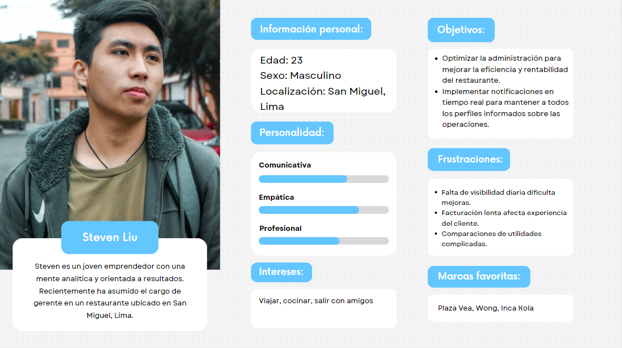
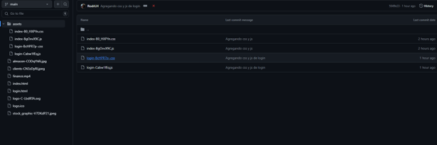

Informe del Trabajo Final </h1>
<h3 style="text-align: center;"> Universidad Peruana de Ciencias Aplicadas </h3>

<h5 style="text-align: center"> Ingeniería de Software</h5>

<h5 style="text-align: center"> Aplicaciones Web - WX56</h5>

<h5 style="text-align: center"> Docente: Alex Humberto Sánchez Ponce</h5>

<h5 style="text-align: center"> Startup: Stocker </h5>

<h5 style="text-align: center"> Producto: Stocker </h5>

## Team members:
| Nombre |Código|
|:-------:|:----------:|
|||
|Barturen Guzman, Alejandro Nicolas|U202214406|
|Elías Sanchez, Harold Miguel|U202212684|
|López Huamán Rodrigo Adrián|U202212338|
|Meneses Arevalo, Victor Manuel|U202212191|
|Salvador Rodríguez, Rodrigo Jesús|U202213646|

<h5 style="text-align: center"> Ciclo 2024-01 </h5>

### Registro de Informes

| Versión   | Fecha       | Autor      | Descripción                                                                                      | Estado    |
|-----------|-------------|------------|--------------------------------------------------------------------------------------------------|-----------|
| 1.0       | 13/04/2024 | Rodrigo Adrián Lopez Huamán U202212338, Harold Miguel Elías Sanchez U202212684, Rodrigo Jesús Salvador Rodríguez U202213646, Alejandro Nicolas Barturen Guzman U202214406, Victor Manuel Meneses Arévalo U202212191 | Realizacion del documento |  COMPLETADO |
|  TP       | 02/05/2024 | Rodrigo Adrián Lopez Huamán U202212338, Harold Miguel Elías Sanchez U202212684, Rodrigo Jesús Salvador Rodríguez U202213646, Alejandro Nicolas Barturen Guzman U202214406, Victor Manuel Meneses Arévalo U202212191 | Segunda versión del Proyecto Final (TP). Se desarrollaron todos los contenidos solicitados para el segundo avance. (Avance del frontend web application y sprint 2) | COMPLETADO |

## Project Report Collaboration Insights:

### Student Outcome

|Criterio Especifico|Acciones Realizadas|
|-------------------|-------------------|
|La capacidad de funcionar efectivamente en un
equipo cuyos miembros juntos proporcionan liderazgo, crean un entorno de
colaboración e inclusivo, establecen objetivos, planifican tareas y cumplen objetivos| Para abordar el Student Outcome 5 de ABET - EAC, se implementaron diversas estrategias centradas en fortalecer las habilidades de trabajo en equipo de los estudiantes. Esto se logró mediante la asignación de proyectos colaborativos que requerían una planificación conjunta de tareas y la consecución de objetivos definidos. Además, se promovió activamente la participación en actividades que permitían a los estudiantes asumir roles de liderazgo, facilitando así el desarrollo de habilidades de liderazgo efectivas. Para crear un entorno de colaboración e inclusión, se fomentaron valores de respeto mutuo, diversidad de opiniones y trabajo armonioso hacia metas comunes. |

## Contenido

1. **Capítulo #1: Introducción.**
   1.1. Startup Profile.
        1.1.1. Descripción del startup.
        1.1.2. Perfiles de los integrantes del equipo.
    1.2.Solution Profile.
        1.2.1. Antecedentes y Problemática.
        1.2.2. Lean UX Process.        
    1.3. Segmentos objetivo.

2. **Capítulo #2: Requirements Elicitation & Amalysis.**
    2.1. Competidores.
        2.1.2 Análisis competitivo.
        2.2.2 Estrategias y tácticas frente a competidores.
    2.2 Entrevistas.
        2.2.1. Diseño de entrevistas.
        2.2.2. Registro de entrevistas.
        2.2.3. Análisis de entrevistas.
    2.3. Needfinding.
        2.3.1. User Personas.
        2.3.2. User Task Matrix.
        2.3.3. User Journey Mapping.
        2.3.4. Empathy Mapping.
        2.3.5. As-is Scenario Mapping.
3. **Capítulo #3: Requirements Specification.**
    3.1. To-Be Scenario Mapping.
    3.2. User Stories.
    3.3. Impact Mapping.
    3.4. Product Backlog.
4. **Capítulo #4: Product Design.**
    4.1. Style Guidelines.
        4.1.1. General Style Guidelines.
        4.1.2. Web Style Guidelines.
    4.2. Information Architecture.
        4.2.1. Organization Systems.
        4.2.2. Labeling Systems.
        4.2.3. SEO Tags and Meta Tags
        4.2.4. Searching Systems.
        4.2.5. Navigation Systems.
    4.3. Landing Page UI Design.
        4.3.1. Landing Page Wireframe.
        4.3.2. Landing Page Mock-up.
    4.4 Web Applications UX/UI Design.
        4.4.1. Web Applications Wireframes.
        4.4.2. Web Applications Wireflow Diagrams.
        4.4.3. Web Applications Mock-ups.
        4.4.4. Web Applications User Flow Diagrams.
    4.5. Web Applications Prototyping.
    4.6. Domain-Driven Software Architecture.
        4.6.1. Software Architecture Context Diagram.
        4.6.2. Software Architecture Container Diagrams.
        4.6.3. Software Architecture Components Diagrams.
    4.7. Software Object-Oriented Design.
        4.7.1. Class Diagrams.
        4.7.2. Class Dictionary.
    4.8. Database Design.
        4.8.1. Database Diagram.
5. **Capítulo #5: Product Implementation, Validation & Deployment.**
    5.1. Software Configuration Management.
        5.1.1. Software Development Environment Configuration.
        5.1.2. Source Code Management.
        5.1.3. Source Code Style Guide & Conventions.
        5.1.4. Software Deployment Configuration.
    5.2. Landing Page, Services & Applications Implementation.
        5.2.1. Sprint 1
            5.2.1.1. Sprint Planning 1.
            5.2.1.2. Sprint Backlog 1.
            5.2.1.3. Development Evidence for Sprint Review.
            5.2.1.4. Testing Suite Evidence for Sprint Review.
            5.2.1.5. Execution Evidence for Sprint Review.
            5.2.1.6. Services Documentation Evidence for Sprint Review.
            5.2.1.7. Software Deployment Evidence for Sprint Review.
            5.2.1.8. Team Collaboration Insights during Sprint.
    5.3. Validation Interview
        5.3.1. Diseño de Entrevista
        5.3.2. Registro de Entrevista
        5.3.3  Video About the product
            5.4. Sprint 2
            5.4.1. Sprint Backlog 2.
            5.4.3. Development Evidence for Sprint Review.
            5.4.4. Testing Suite Evidence for Sprint Review.
            5.4.5. Execution Evidence for Sprint Review.
            5.4.6. Services Documentation Evidence for Sprint Review.
            5.4.7. Software Deployment Evidence for Sprint Review.
            5.4.8. Team Collaboration Insights during Sprint.
7. **Conclusiones.**
8. **Bibliografía.**
9. **Anexos.**

## Capítulo I: Introducción.

### 1.1. **Startup Profile.**

####     1.1.1.   Descripción del startup

Stocker, es una iniciativa liderada por estudiantes de la Universidad Peruana de Ciencias Aplicadas (UPC), destacada como un startup emergente. Nuestro equipo de ingenieros talentosos de la Facultad de Ingeniería ha creado un sistema de registro y control para apoyar el crecimiento de la comunidad empresarial. Stocker está diseñado para satisfacer las necesidades de los negocios pequeños, permitiendo el registro y gestión eficiente de clientes, proveedores, inventarios, ventas, compras, ganancias y perfiles comerciales.

#### Misión:
Nuestra misión es facilitar el éxito de los pequeños negocios mediante un sistema de gestión empresarial integral, promoviendo la eficiencia en el registro y control de clientes, inventarios, ventas, compras, ganancias y perfiles de negocio. Nos comprometemos a proporcionar herramientas que fomenten la gestión transparente y el crecimiento sostenible, contribuyendo así al desarrollo económico y social de la comunidad.

#### Visión:
Aspiramos a que nuestro sistema de gestión empresarial se convierta en la opción preferida para emprendedores y pequeños empresarios, siendo reconocidos como un socio confiable en su camino hacia el éxito. Buscamos ser líderes en la innovación tecnológica, brindando constantemente soluciones que se adapten a las necesidades cambiantes del mercado y que impulsen el crecimiento y la competitividad de nuestros usuarios.

####     1.1.2. Perfiles de los integrantes del equipo

| Nombre                           | Descripción de Perfil                                                                                                                                   |
|----------------------------------|-----------------------------------------------------------------------------------------------------------------------------------------------|
| Alejandro Nicolas Barturen Guzman |Soy estudiante de la carrera de Ingeniería de Software y actualmente me encuentro en 5to ciclo, me considero una persona bastante eficiente y capaz que siempre busca la solución más rápida y que mejor funcione. Siempre trato de tener una comunicación fluida con todos los miembros de mi grupo para así evitar cualquier inconveniente al momento de realizar el trabajo |
|Harold Miguel Elías Sanchez  |Mi nombre es Harold Miguel Elías Sánchez con código u202212684 tengo 19 años y estoy en quinto ciclo de la carrera de ingeniería de software. Mi conocimiento técnico abarca el lenguaje C++, que manejo de manera intermedia. Además, poseo habilidades básicas que me permiten contribuir efectivamente en equipos, aportando ideas y trabajando en colaboración para alcanzar nuestras metas conjuntas. |            
|  Rodrigo Adrián López Huamán     | Soy Rodrigo Adrián López Huamán, estudiante de quinto ciclo de Ingeniería de Software, tengo 18 años y soy un chico responsable y comprometido con mis actividades. Además, me considero una persona creativa y capaz de trabajar en equipo para alcanzar nuestras metas. También tengo habilidades en el manejo de conflictos, lo que me permite resolver situaciones difíciles de manera efectiva. Estoy emocionado de seguir aprendiendo y creciendo en esta carrera.   |          
| Victor Manuel Meneses Arevalo        | Soy estudiante de la carrera de Ingeniería de Software y actualmente me encuentro en 5to ciclo, me considero una persona bastante eficiente y capaz que siempre busca la solución más rápida y que mejor funcione. Siempre trato de tener una comunicación fluida con todos los miembros de mi grupo para así evitar cualquier inconveniente al momento de realizar el trabajo.|
| Rodrigo Jesús Salvador Rodríguez        | Me llamo Rodrigo Jesús Salvador Rodríguez, tengo 18 años, estudio la carrera de Ingeniería de Software en la Universidad Peruana de Ciencias Aplicadas (UPC). Me considero una persona responsable y puntual en todo tipo de aspectos, esto lo voy a ver reflejado en este proyecto, como miembro de este equipo me comprometo a seguir las indicaciones al pie de la letra, seguir recomendaciones y apoyar siempre a mis compañeros para presentar el mejor proyecto grupal. |

### 1.2. **Solution Profile.**

####     1.2.1. Antecedentes y Problemática (The 5 ‘W’s y 2 ‘H’s)

### ¿Qué es “Stocker”?
La gestión y organización de distintos procesos es vital para el correcto funcionamiento de una empresa. Nuestro producto es una app que se encarga de la recopilación y la gestión de distintos procesos realizados por microempresas en un solo lugar 

### ¿Quiénes son los usuarios principales de “Stocker”?
Los principales usuarios que harán uso de nuestro producto serán los dueños de microempresas en desarrollo que no cuenten con los recursos para diseñar una aplicación propia de gestión o que no cuenten con una gran demanda que los aliente a crearse una

### ¿Dónde se encuentra el problema?
El problema se toda microempresa que se encuentre en desarrollo o que tenga no haya un gran periodo de tiempo desde su creación 

###  ¿Cuándo se identificó la problemática?
Hemos identificado que el problema ocurre al momento de que los dirigentes de una microempresa en desarrollo empiezan a incrementar la cantidad de procesos que esta realiza y no cuentan con un método eficaz que recopile a todos los procesos para una mayor facilidad de gestión 

### ¿Cuándo sucede el problema?
El problema surge cuando el cliente tiene la necesidad de asistir a un evento social y carece de la vestimenta adecuada.

### ¿Por qué es importante abordar este problema?
Los clientes utilizan el producto cuando necesitan encontrar vestimenta para eventos sociales específicos.

### ¿Cómo aborda Stocker la gestión de la salud y el bienestar?
Nuestro ayuda a mejorar el bienestar de nuestros usuarios ya que, al encargarse de gestionar los procesos de su negocio logra que no tenga tanta carga de estrés 

### ¿Cuánto tiempo llevó desarrollar Stocker?
El desarrollo de este startup, que se centra en soluciones tecnológicas para pequeñas empresas, se llevó a cabo durante un período de 1 mes. Este tiempo fue esencial para la planificación, desarrollo, y pruebas iniciales del producto, siguiendo la metodología Lean Startup, que enfatiza la creación, medición, y aprendizaje continuo para validar y mejorar la solución propuesta

####     1.2.2. Lean UX Process

#####         **1.2.2.1.Lean UX Problem Statements.**

**Plantiamiento del problema:**
El principal desafío que enfrentan los propietarios de pequeños negocios con nuestro sistema de gestión empresarial radica en la falta de una solución integral y eficiente para organizar, supervisar y optimizar todas las áreas de su negocio. Nuestro objetivo es proporcionar una plataforma que permita una gestión eficiente de clientes, proveedores, inventarios, ventas, compras y perfiles empresariales, al mismo tiempo que garantice una experiencia de usuario intuitiva y fácil de usar.

**Usuario Principal:**
Nuestro usuario principal es cualquier propietario de pequeño negocio que busca gestionar eficazmente todas las áreas de su empresa. Estos propietarios están interesados en optimizar sus operaciones comerciales, supervisar el desempeño de su negocio y tomar decisiones informadas para impulsar el crecimiento y el éxito empresarial. Buscan una solución integral que les permita gestionar clientes, inventarios, ventas, compras y perfiles empresariales de manera eficiente y conveniente.

**Problema Principal:**
El principal desafío radica en la complejidad y falta de claridad en la interfaz de nuestro sistema de gestión empresarial. Los usuarios pueden sentirse abrumados o confundidos al intentar acceder a funciones críticas del sistema, lo que limita su capacidad para gestionar eficazmente todas las áreas de su negocio y aprovechar al máximo todas las funcionalidades disponibles.

**Impacto Negativo:**
Este problema tiene un impacto negativo en la experiencia del usuario. Los usuarios pueden no utilizar plenamente las capacidades de Stocker y pueden experimentar frustración o descontento debido a la falta de accesibilidad y claridad en la interfaz. Esto puede llevar a una menor productividad y eficiencia en la gestión de sus negocios, así como a una percepción negativa de la plataforma en general.

**Solución Exitosa:**
Desarrollar un sistema de gestión empresarial integral y fácil de usar que permita a los propietarios de pequeños negocios gestionar eficientemente todas las áreas de su negocio. La solución debe proporcionar herramientas para gestionar clientes, inventarios, ventas, compras y perfiles empresariales de manera eficaz y centralizada.

**Medición al Éxito:**
El éxito de esta solución se medirá mediante métricas clave, como la tasa de utilización de las funciones de gestión empresarial, la frecuencia de uso de las diferentes herramientas disponibles en Stocker, y la retroalimentación de los usuarios sobre la facilidad de uso y la accesibilidad de la interfaz rediseñada. Además, se realizan encuestas de satisfacción del usuario para evaluar la percepción general de la experiencia de usuario mejorada. Un aumento en la adopción de características y una mejora en la satisfacción del usuario serán indicadores clave del éxito de la solución.
 

#####         **1.2.2.2.Lean UX Assumptions.**

Creemos que simplificar la interfaz de usuario de “Stocker” conducirá a una mayor adopción por parte de los propietarios de pequeñas empresas, ya que facilitará la comprensión y el uso de todas las funcionalidades disponibles.
Pensamos que al proporcionar una experiencia de usuario más intuitiva y fácil de usar en “Stocker”, los propietarios de pequeñas empresas serán más propensos a integrar la aplicación en su flujo de trabajo diario y a aprovechar al máximo sus capacidades de gestión empresarial.
Creemos que al agregar características personalizadas que se adapten a las necesidades específicas de las microempresas, aumentaremos la satisfacción del usuario y la utilidad percibida de “Stocker”, lo que a su vez impulsará la retención de clientes y la recomendación boca a boca.
Intuimos que al ofrecer un proceso de incorporación claro y guiado en “Stocker”, reduciremos la curva de aprendizaje para los nuevos usuarios, lo que resultará en una mayor retención y compromiso con la plataforma a largo plazo.
Estimamos que al implementar un sistema de retroalimentación continua en “Stocker” y responder rápidamente a las solicitudes de los usuarios, mejoraremos la percepción general de la calidad del servicio y fomentaremos una relación de confianza con nuestra base de clientes.
Esperamos que al proporcionar soporte técnico y de atención al cliente receptivo y de alta calidad, aumentaremos la satisfacción del usuario y fomentaremos la lealtad a la marca entre los propietarios de pequeñas empresas que utilizan “Stocker”.

#####         **1.2.2.4.Lean UX Canvas.**
 
 

### 1.3. **Segmentos objetivo.**

#### **Segmento 1: Dueños de Librerías**
El sistema ofrece una solución integral para gestionar inventario, transacciones de venta y relaciones con los clientes. Permite un seguimiento preciso del inventario, gestión de pedidos especiales y automatización de tareas administrativas.

##### Aspectos Demográficos: 
Los dueños de librerías en Lima Metropolitana pueden variar en cuanto a edades, géneros y niveles socioeconómicos. Pueden ser tanto jóvenes emprendedores como individuos más experimentados en el mundo empresarial.
 
##### Aspectos Geográficos: 
Residen principalmente en Lima Metropolitana y áreas cercanas, donde operan sus negocios. Esto incluye distritos urbanos y suburbanos de la ciudad.

 
#### **Segmento 2: Dueños de Ferreterias**
 Proporciona herramientas para gestionar inventario, reservas, pedidos y facturación, optimizando el proceso de pedido y entrega de productos de ferretería, así como la gestión de clientes y análisis de ventas.

##### Aspectos Demográficos:
Los propietarios de ferreterías en Lima Metropolitana pueden ser de diversas edades, géneros y niveles socioeconómicos. Pueden ser desde jóvenes emprendedores hasta empresarios con experiencia en la industria ferretera.

##### Aspectos Geográficoas:
Residen y operan sus ferreterías principalmente en Lima Metropolitana y áreas circundantes. Esto incluye distritos urbanos y áreas comerciales de la ciudad.

 #### **Segmento 3: Duesños de Bodegas  **
Ayuda a gestionar inventario, proveedores y logística de almacenamiento y entrega. Facilita la gestión de clientes, personalización de promociones y análisis de mercado para optimizar las ventas y la eficiencia operativa.

##### Aspectos demográficos:
Los dueños de bodegas en Lima Metropolitana son diversos en cuanto a edades, géneros y niveles socioeconómicos. Pueden ser desde emprendedores jóvenes hasta individuos con experiencia en el sector minorista.
 
##### Aspectos Geográficoas:
Residen y operan sus bodegas principalmente en Lima Metropolitana y áreas circundantes. Estas áreas incluyen tanto zonas urbanas como suburbanas de la ciudad.  

## Capítulo II: Requirements Elicitation & Analysis

### 2.1. **Competidores.**
 
 
### Análisis de Competencia

En base a nuestra investigación, hemos identificado los siguientes tres posibles competidores, aunque no son directos, tienen una gran relación para nuestro startup de gestión empresarial para micronegocios:

- Sage Group: Con su software “Sage Business Cloud” que se especializa en pequeñas empresas, proporcionas un servicio de contabilidad en la nube que contiene desde la gestión financiera pasando por la administración de inventario hasta la gestión de nóminas. Con esto se busca ayudar a simplificar las operaciones financieras e impulsar el desarrollo empresarial
- Block: Con su software “Square” que consiste en una plataforma que ofrece soluciones de punto de venta, administración del inventario y analizar datos de la empresa. Se facilita la realización de los procedimientos ya mencionados, implementa herramientas que ayudan a optimizar operaciones comerciales 
- H&R Block: Con su software “Wave” que es una herramienta de contabilidad de uso gratuito con las siguientes características: facturación personalizada, seguimiento de gastos, contabilidad de doble entrada y reportes financieros detallados

##### Comparativa con Competidores

| Nombre | Stocker | Sage Group | Block | H&R BLOCK |
|---|---|---|---|---|
| Logo |  |  |  |  |
| Overview |     Una   aplicación que ofrece una solución completa para los principales procesos que   realiza un microempresa    |     App   que  se especializa en pequeñas   empresas, proporcionas un servicio de contabilidad en la nube que contiene   desde la gestión financiera pasando por la administración de inventario hasta   la gestión de nómina       |     Una   plataforma que ofrece soluciones de punto de venta, administración del   inventario y analizar datos de la empresa.    |     Es una   herramienta de contabilidad de uso gratuito con las siguientes   características: facturación personalizada, seguimiento de gastos,   contabilidad de doble entrada y reportes financieros detallados    |
| Ventaja Competitiva |     La ventaja competitiva de   nuestra aplicación se debe a su enfoque centrado en cubrir las necesidades  específicas de las microempresas       |     Su principal ventaja   competitiva se basa en su amplia gama de operaciones que se integran en una   sola plataforma     |      La ventaja competitiva de Square se   encuentra en su enfoque en la simplicidad y la accesibilidad. Con una   interfaz fácil de usar y herramientas intuitivas    |     La ventaja competitiva de   Square se encuentra en su enfoque en la simplicidad y la accesibilidad. Con   una interfaz fácil de usar y herramientas intuitivas    |
| Mercado  Objetico | microempresa     | Pequeñas y/o medianas empresas    | Pequeñas empresas     | Pequeñas empresas    |
|     Estrategias    de Marketing    | Publicidad por medio de redes sociales | Participación en eventos y ferias comerciales | Publicidad en redes sociales | Publicidad por medio de optimización de motores de búsqueda |
| Productos  & Servicios  | Stocker |  |  |  |
| Precios y Costos | La aplicación es de uso gratuito, pero contiene un modo premium para añadir ciertas características | Cuenta con distintos planes de suscripción | Cuenta con distintos planes   de suscripción    | La aplicación es de uso   gratuito, pero contiene un modo premium para añadir ciertas   características     |
| Fortalezas | - Se centra exclusivamente en las necesidades de las microempresas - Adaptabilidad según las necesidades del usuario  | - Es una marca que ya cuenta con una   trayectoria establecida      - Cuenta con   una atención al cliente destacable      - Cuenta con   una amplia variedad de planes para distintos tipos de clientes     | - Soluciones intuitivas y sencillas de   manejar      - Fuerte   presencia en línea     | - Interfaz   intuitiva y sencilla de usar y entender      - Al usar guardar la información en la nube permite la   manipulación de los datos desde cualquier lugar    |
| Oportunidades | - Aprovechar el incremento   de microempresas emergentes     | - Aprovechar el incremento   de microempresas emergentes     | - Aprovechar el incremento   de microempresas emergentes     | - Aprovechar el incremento de microempresas emergentes     |
| Debilidades | - Nuestra app al tener   recursos limitados, no cuenta con un gran presupuesto en marketing     | - Los planes de suscripciones pueden ser un poco altos en comparación a otros softwares  - Cuenta con demasiadas funciones, que una empresa pequeña no precisa | - Dependencia de tarifas de procesamiento de pagos, lo que puede resultar en   costos adicionales para los clientes.    | - Total dependencia a los ingresos generados por los servicios   complementarios como la nomina     |
| Amenazas  | - Surgimiento de otros softwares de gestión   dirigidos a empresas     - Cambios en las regulaciones fiscales y financieras     - Aparición de nuevas tecnologías maliciosas que atentan contra la integridad de la   app     | - Surgimiento de otros softwares de gestión   dirigidos a empresas     - Cambios en   las regulaciones fiscales y financieras     - Aparición   de nuevas tecnologías maliciosas que atentan contra la integridad de la   app     | - Surgimiento de otros softwares de gestión dirigidos a empresas  - Cambios en las regulaciones fiscales y financieras  - Aparición de nuevas tecnologías maliciosas que atentan contra la integridad de la app | - Surgimiento de otros softwares de gestión dirigidos a empresas     - Cambios en las regulaciones fiscales y financieras     - Aparición de nuevas tecnologías maliciosas que atentan contra   la integridad de la app.    |

####     2.1.2. Estrategias y tácticas frente a competidores.

- **Enfocarse completamente en el nicho:** Nuestra ya está diseñada específicamente para funcionar con microempresas, Así que seguiremos por ese camino y adaptamos todo nuestro sistema para la comodidad y adaptabilidad  de estas mismas }

- **Potenciar la personalización y flexibilidad:** Nuestra aplicación está diseñada para que los usuarios puedan personalizarla en base a las necesidades de su negocio y que sea intuitiva de usar. Así que, se implementan nuevas funciones para que faciliten la adaptabilidad del usuario, como agregar tutoriales o guías      

- **Precio atractivo:** Buscaremos un equilibrio entre el servicio gratuito y el servicio premium para que ambos tipos de usuarios se encuentren satisfechos  

### 2.2. **Entrevistas.**

####     2.2.1. Diseño de entrevistas.

#### **Segmento Objetivo 1:Dueños de Librerias**
- ¿Cuáles son los principales desafíos que enfrentas en la gestión de tu librería?
- ¿Qué características consideras esenciales en un sistema de gestión empresarial para librerías?
- ¿Cómo te gustaría que el sistema ayudara a mejorar la gestión de inventario y transacciones de venta?
- ¿Qué tipo de soporte o capacitación necesitarías para implementar y utilizar eficazmente el sistema?

#### **Segmento Objetivo 2: Dueños de Ferreterias**
- ¿Cuáles son los aspectos de la gestión de tu ferretería que consideras más difíciles o que te gustaría optimizar?
- ¿Qué funcionalidades crees que serían más útiles para gestionar el inventario de productos, pedidos de clientes y facturación en tu ferretería?
- ¿Cómo te gustaría que el sistema ayudara a mejorar la eficiencia en el proceso de pedido y entrega de productos de ferretería?
- ¿Qué tipo de análisis de ventas te gustaría poder realizar con el sistema en tu ferretería? 

#### **Segmento Objetivo 3: Dueños de Bodegas**
- ¿Qué desafíos en la gestión de tu bodega te gustaría abordar con un sistema de gestión empresarial?
- ¿Qué características consideras esenciales para gestionar inventario, proveedores y logística de almacenamiento y entrega?
- ¿Cómo te gustaría que el sistema facilitara la gestión de clientes y la personalización de promociones?
- ¿Qué tipo de análisis de mercado te gustaría poder realizar para optimizar las ventas y la eficiencia operativa?

####     2.2.2. Registro de entrevistas.

##### *Entrevista 1:* 
*Segmento 1*
**Nombre:**
Isabel Arevalo
#### Sexo: 
Femenino
#### Edad: 
61
####Ubicación: 
Pueblo Libre
#### Link: 
[Entrevista1](https://youtu.be/3LFFYc8qpWY)
#### Duración: 
4:10
#### Resumen: 
En la entrevista con el propietario de una librería, se destacó la necesidad de un sistema que permita un control sencillo de los productos y detalles de ingresos y egresos por día, semana y mes. El entrevistado expresó su deseo de tener un sistema que facilite el manejo de pagos tanto en línea como en efectivo, así como la capacidad de registrar gastos como electricidad y agua. Se mencionó la importancia de funciones con voz para búsqueda de productos y ventas, y la conexión directa con la plataforma de SUNAT para facturaciones. Se valoró la interfaz sencilla y didáctica, especialmente para dispositivos móviles, y la posibilidad de soporte por chat y capacitación presencial. Además, se enfatizó la necesidad de un sistema que permita un seguimiento detallado de los ingresos y egresos, facilitando así la toma de decisiones informadas sobre la gestión del negocio.

##### *Entrevista 1:* 
*Segmento 2*
**Nombre:**
Freddy Condori Tacora
#### Sexo: 
Masculino
#### Edad: 
45
#### Ubicación: 
Breaña, Lima
#### Link:
[Entrevista2](https://youtu.be/kVTbZlRw8R0)
#### Duración: 
2:12
#### Resumen:
En la entrevista se resaltó la importancia de un sistema de gestión de ventas con facilidad para acceder a precios y calcular los ingresos del negocio, así como la necesidad de que sea multiplataforma, compatible con dispositivos móviles, tabletas y computadoras. Se requiere la capacidad de crear y emitir automáticamente facturas, boletas y proformas, además de brindar a los proveedores la opción de enviar su stock y mantener actualizados sus precios. También se mencionó la necesidad de ofrecer capacitación para el uso del sistema de forma online.

##### *Entrevista 2:* 
*Segmento 2*
**Nombre:**
George Condori Tacora
#### Sexo: 
Masculino
#### Edad: 
30
#### Ubicación: 
Breaña, Lima
#### Link:
[Entrevista2](https://youtu.be/IoGntsz3J7Y)
#### Duración: 
2:12
#### Resumen:
En la entrevista, se enfatizó la necesidad de un sistema de gestión de ventas que también incorpore funciones de código de barras, registro de precios de productos, emisión de facturas y boletas, así como la capacidad de generar balances según períodos de tiempo, especialmente semanalmente, para el seguimiento de compras y ventas. Se requiere la opción de enviar promociones a través de redes sociales, particularmente por WhatsApp, así como la creación de una lista de precios actualizada. Además, se necesita una función para gestionar relaciones con proveedores, permitiendo el acceso a los precios recientes de compra de productos. Por último, se solicita capacitación presencial para el uso efectivo del sistema.

##### *Entrevista 1:*
*Segmento 3*
**Nombre:**
Sharon Alvarez
#### Sexo: 
Femenino
#### Edad: 
54
#### Ubicación: 
Callao, Lima
#### Link:
[Entrevista3](https://youtu.be/ysFA6OwSMGI)
#### Duración: 
4:38
#### Resumen: 
En la entrevista con el dueño de una bodega, se identificó el principal desafío como la falta de digitalización del inventario, lo que dificulta la escalabilidad del negocio. Se mencionó la dificultad para saber en qué categoría de productos se encuentra más estancada y la necesidad de llevar un registro de las fechas de caducidad de los perecibles para evitar pérdidas. Se deseaban alertas para los perecibles próximos a su caducidad, un balance de ventas por categoría y facilidad para el registro de comprobantes de compra y venta. Además, se buscaba la conexión con un chat grupal para realizar envíos de mensajes promocionales sobre productos rezagados. Se enfatizó la importancia de un sistema que permita una gestión eficiente del inventario y una mejor comunicación con los clientes, lo cual es esencial para mantener la satisfacción del cliente y maximizar las ventas.

##### *Entrevista 2:*
*Segmento 3*
**Nombre:**
Fernando Alvarez
#### Sexo: 
Masculino
#### Edad: 
29
#### Ubicación: 
Pueblo Libre, Lima
#### Link:
[Entrevista3](https://youtu.be/8dNPNSlTYik)
#### Duración: 
10:03
#### Resumen:
En la entrevista se subrayó la necesidad de un sistema de gestión de ventas que aborde el manejo de productos perecibles y entregas a domicilio, con integración a WhatsApp Business y su catálogo. Se requiere un reporte claro de cuentas en intervalos de tiempo, especialmente semanal, así como la capacidad de ingresar un estimado de duración para productos perecibles, con alertas automáticas para gestionar su venta antes de su vencimiento. Además, se solicitó un reporte claro de las transacciones del negocio, capacitación para el uso del sistema y la capacidad de calcular ganancias para reinversiones, gastos y ganancia neta.

####     2.2.3. Análisis de entrevistas.

#### Segmento #1:

**Hallazgos:**

- Necesidades de Gestión Integral: La persona entrevistada nos comenta que uno de sus principales problemas es la necesidad de un sistema completo que le permita administrar de manera efectiva tanto el inventario de productos como los aspectos financieros de su empresa. Esto incluye un seguimiento detallado de los ingresos y egresos por períodos específicos, como día, semana y mes.

- Facilidades en los Procesos de Pago y Facturación: La persona que fue entrevistada nos comenta sobre la importancia de tener opciones de pagos flexibles para poder realizar pagos en efectivo y en línea.  También nos comentó que es muy importante el tener conexión de manera directa con SUNAT para el tema de facturas.

- Experiencia del Usuario y Soporte: El hecho de tener una interfaz fácil de usar y que se adapte a distintos dispositivos, es muy crucial para el buen uso de los usuarios.

#### Segmento #2:

**Hallazgos:**
- Acceso Rápido a Precios e Ingresos: Se evidencia la importancia de contar con un sistema que permita acceder fácilmente a los precios de productos y calcular los ingresos del negocio de manera rápida y precisa.

- Compatibilidad Multiplataforma: Se subraya la necesidad de que el sistema sea compatible con diferentes dispositivos, como móviles, tabletas y computadoras, para garantizar la accesibilidad y la flexibilidad en su uso.

- Automatización de Documentos Financieros: Se destaca la necesidad de automatizar la creación y emisión de facturas, boletas y proformas para agilizar los procesos administrativos y financieros del negocio.
- Gestión de Relaciones con Proveedores: Se resalta la importancia de tener una función que facilite la gestión de relaciones con proveedores, permitiendo el acceso a información actualizada sobre precios de compra y stock de productos.

- Envío de Promociones por Redes Sociales: Se evidencia la necesidad de enviar promociones y ofertas a través de redes sociales, especialmente mediante WhatsApp, para llegar de manera efectiva a los clientes y aumentar las ventas.

- Generación de Balances Temporales: Se menciona la importancia de generar balances y reportes financieros según períodos de tiempo específicos, como semanalmente, para realizar un seguimiento detallado de las compras y ventas y tomar decisiones estratégicas basadas en datos precisos.

- Capacitación en el Uso del Sistema: Se resalta la necesidad de ofrecer capacitación tanto en línea como presencial para garantizar un uso efectivo y óptimo del sistema por parte de los usuarios.

 
#### Segmento #3:

**Hallazgos:**

- Necesidad de Digitalización del Inventario: La persona entrevistada nos comenta que uno de sus desafíos es la falta de digitalización del inventario, dado que, esto trae dificultades para el negocio. 

- Gestión Efectiva de Productos Perecibles: Se mencionó la dificultad para llevar un registro de las fechas de caducidad de los productos perecibles y la necesidad de evitar pérdidas asociadas con la falta de seguimiento. 

- Mejora en la Gestión de Ventas y Comunicación con los Clientes: Se expresó el interés en contar con un balance de ventas por categoría de productos, lo que proporcionaría una visión clara sobre el rendimiento de cada línea de productos y facilitaría la toma de decisiones estratégicas.

### 2.3. **Needfinding.**

####     2.3.1. User Personas.

## Segmento 1

 

## Segmento 2

## Segmento 3

####     2.3.2. User Task Matrix.

## Segmento 1

| Tarea/Función | Frecuencia | Importancia |
|---|---|---|
| Implementar sistema de control de ingresos y egresos    | Alta    | Alta |
| Supervisar gestión de pagos    | Alta    | Alta    |
| Registrar gastos como electricidad y agua    | Alta    | Alta |
|  Conectar con la plataforma de SUNAT para   facturaciones    | Media | Alta |

## Segmento 2

| Tarea/Función | Frecuencia | Importancia |
|---|---|---|
| Implementar sistema de inventario digital    | Alta    | Alta |
| Analizar ventas por categoría    | Alta    | Alta    |
| Gestionar registro de comprobantes    | Alta    | Alta |
| Administrar chat grupal con clientes    | Media | Alta |

## Segmento 3

| Tarea/Función | Frecuencia | Importancia |
|---|---|---|
| Implementar sistema de inventario digital    | Alta    | Alta |
| Analizar ventas por categoría    | Alta    | Alta    |
| Gestionar registro de comprobantes    | Alta    | Alta |
| Administrar chat grupal con clientes    | Media | Alta |

####     2.3.3. User Journey Mapping.

####     2.3.4. Empathy Mapping.

####     2.3.5. As-is Scenario Mapping.

 

## Capítulo III: Requirements Specification

### 3.1 **To-Be Scenario Mapping.**

| Fases | Seleccionar el software a utilizar     | seleccionar el proceso deseado    | guardar la modificación del contenido deseado    |
|---|---|---|---|
| Doing | - Abrir la aplicación que recopila todos los procesos necesarios para   la gestión de una microempresa    - Revisar entre las diferentes categorías el proceso que se   requiera      | - Una vez identificado el proceso se debe de seleccionar      - Se selecciona si editamos o creamos un elemento      - Completar y/o modificar los recuadros con la información   correspondiente     | -Al tener todos los recuerdos completos, se procede a   seleccionar la opción guardar      -Se modifican o agregan los datos en todos los dispositivos que tengan   la app     |
| Thinking | Piensa en óptimo que es contar con con un software completo en vez de   varios que cumplen solo una función     | Piensa en la cantidad de variedad de procesos con el que cuenta el   software para la solución de distintas situaciones      | Piensa lo facil que es ingresar o modificar datos en el software     |
| Feeling | Se siente cómodo ya que no tiene que instalar muchos softwares de gestión | Se siente conforme ya que el software cuenta con todos los procesos   necesarios para el funcionamiento de una microempresa     | Se siente a gusto ya que no tiene que actualizar actualizar los datos   individualmente en cada máquina     |

### 3.2 **User Stories.**

| User Story ID | Titulo | Descripción | Criterio de aceptación | Relación (EPIC ID) |
|---|---|---|---|---|
| US01 | Registro de Usuario | Como usuario, quiero poder registrarme en Stocker para acceder a todas sus funciones. | Escenario 1: Registro Exitoso - Dado que un usuario llega a la página de registro. - Cuando el usuario ingresa datos válidos, incluyendo nombre, correo electrónico y contraseña. - Entonces el usuario debe recibir una confirmación de registro. Escenario 2: Registro con Información Incompleta - Dado que un usuario llega a la página de registro. - Cuando el usuario intenta registrarse sin completar todos los campos requeridos o proporciona información incorrecta. - Entonces el usuario debe recibir un mensaje de error que indique qué campos deben completarse o corregirse. Escenario 3: Registro con Correo Electrónico Existente - Dado que un usuario llega a la página de registro. - Cuando el usuario intenta registrarse con una dirección de correo electrónico que ya está en uso por otro usuario. - Entonces el usuario debe recibir un mensaje de error que indique que la dirección de correo electrónico ya está registrada y que debe usar una diferente. | EP01 |
| US02 | Iniciar Sesión | Como usuario registrado, quiero poder iniciar sesión en Stocker para acceder a mi perfil y datos de salud. | Escenario 1: Inicio de Sesión Exitoso - Dado que un usuario registrado desea iniciar sesión. - Cuando el usuario proporciona sus credenciales de inicio de sesión válidas (correo electrónico y contraseña). - Entonces el usuario debe poder acceder a su cuenta y ser redirigido a su perfil. Escenario 2: Credenciales de Inicio de Sesión Incorrectas - Dado que un usuario registrado desea iniciar sesión. - Cuando el usuario proporciona credenciales incorrectas, ya sea un correo electrónico incorrecto o una contraseña incorrecta. - Entonces el usuario debe recibir un mensaje de error que indique que las credenciales son incorrectas y se le debe pedir que las ingrese nuevamente. Escenario 3: Recuperación de Contraseña - Dado que un usuario registrado olvidó su contraseña. - Cuando el usuario hace clic en la opción "¿Olvidaste tu contraseña?" en la página de inicio de sesión. - Entonces el usuario debe recibir instrucciones para restablecer su contraseña a través de su dirección de correo electrónico registrada. | EP01 |
| US03 | Búsqueda de Procesos de Negocio | Como usuario, quiero buscar procesos de negocio específicos en Stocker para obtener información sobre su gestión y control. | Escenario 1: Búsqueda Exitosa de Procesos de Negocio - Dado que un usuario desea buscar información sobre procesos de negocio específicos. - Cuando el usuario ingresa un proceso de negocio en la barra de búsqueda y presiona "Buscar". - Entonces el usuario debe recibir una lista de resultados relacionados con ese proceso de negocio. Escenario 2: Selección de Proceso para Detalles - Dado que un usuario ha realizado una búsqueda de procesos de negocio. - Cuando el usuario hace clic en un proceso de la lista de resultados. - Entonces el usuario debe ser redirigido a una página que muestre información detallada sobre el proceso de negocio seleccionado. Escenario 3: Búsqueda sin Resultados o sin Coincidencias - Dado que un usuario desea buscar información sobre procesos de negocio específicos. - Cuando el usuario ingresa un proceso en la barra de búsqueda y presiona "Buscar". - Entonces el usuario puede recibir un mensaje que indique que no se encontraron resultados relacionados con el proceso ingresado, o bien, se muestran resultados alternativos relacionados con términos similares. | EP02 |
| US04 | Seguimiento de Productos en Inventario | Como usuario, deseo poder registrar y hacer un seguimiento de los productos en inventario en Stocker. | Escenario 1: Agregar un Producto Exitosamente - Dado que un usuario necesita llevar un seguimiento de los productos en el inventario de su negocio. - Cuando el usuario ingresa un nuevo producto en la aplicación. - Y proporciona el nombre del producto, la cantidad disponible y otra información relevante. - Entonces el producto debe registrarse en la lista de seguimiento del usuario. Escenario 2: Notificación de Reabastecimiento de Inventario - Dado que un usuario ha registrado productos en la aplicación. - Cuando la cantidad de un producto en inventario alcanza un nivel bajo o predefinido. - Entonces el usuario debe recibir una notificación en la aplicación para recordarle reabastecer el inventario de ese producto. Escenario 3: Actualización de Inventario - Dado que un usuario ha reabastecido un producto en inventario. - Cuando el usuario actualiza la cantidad disponible del producto en la aplicación. - Entonces el inventario del producto debe actualizarse en la aplicación, reflejando la nueva cantidad disponible.  | EP03 |
| US05 | Registro de Compras de Clientes | Como usuario, quiero poder registrar las compras realizadas por los clientes en Stocker para llevar un seguimiento de las transacciones y el inventario. | Criterios de Aceptación: Escenario 1: Registrar Compra de Cliente - Dado que un cliente realiza una compra en el establecimiento. - Cuando el administrador inicia sesión en la aplicación Stocker. - Y selecciona la opción de "Registrar Compra de Cliente". Luego, el administrador debe ingresar los detalles de la compra, incluyendo el nombre del cliente, los productos adquiridos y la cantidad. - Después de guardar el registro, el sistema debe actualizar automáticamente el inventario y generar un recibo para el cliente. Escenario 2: Consultar Historial de Compras de Clientes - Dado que el administrador desea realizar un seguimiento de las compras realizadas por los clientes. - Cuando el administrador accede a la sección de "Historial de Compras de Clientes" en la aplicación. - Entonces el administrador debe ver una lista de todas las compras registradas anteriormente, con detalles como la fecha, el cliente y los productos adquiridos. Escenario 3: Generar Informes de Ventas - Dado que el administrador necesita analizar el desempeño de ventas del negocio. - Cuando el administrador accede a la sección de "Informes de Ventas" en la aplicación. - Entonces el administrador debe poder generar informes detallados sobre las ventas realizadas en un período específico, incluyendo datos como los productos más vendidos y los ingresos totales. | EP03 |
| US06 | Consulta de Historial de Transacciones |  Como usuario, quiero poder acceder y revisar el historial de transacciones de mi negocio en Stocker para llevar un registro de las compras, ventas y movimientos financieros anteriores. | Escenario 1: Ver Historial de Transacciones - Dado que un usuario desea acceder al historial de transacciones de su negocio en la aplicación Stocker. - Cuando el usuario inicia sesión en la aplicación. Y selecciona la opción de "Historial de Transacciones" en su perfil empresarial. - Entonces el usuario debe ver una lista de todas las transacciones anteriores, ordenadas por fecha, con detalles como el tipo de transacción, el monto y la descripción. Escenario 2: Detalles de Transacción - Dado que un usuario quiere obtener información detallada sobre una transacción específica en su historial. - Cuando el usuario selecciona una transacción de la lista. - Entonces el usuario debe ver una página con información detallada, que incluye la fecha de la transacción, el tipo (compra o venta), los artículos involucrados, el monto total y cualquier nota o comentario asociado. Escenario 3: Exportar Historial de Transacciones - Dado que un usuario necesita compartir el historial de transacciones con su contador o equipo financiero. - Cuando el usuario accede al historial de transacciones. - Entonces el usuario debe tener la opción de exportar el historial en un formato compatible, como CSV o PDF, para compartirlo fácilmente con otros miembros del equipo. | EP04 |
| US07 | Recordatorio de Reunión de Negocios | Como usuario, quiero recibir recordatorios de mis próximas reuniones de negocios en Stocker para estar siempre informado y puntual en mis compromisos laborales. | Escenario 1: Programación de una Reunión de Negocios - Dado que un usuario desea programar una reunión de negocios en la aplicación [Nombre del Producto]. - Cuando el usuario inicia sesión en la aplicación. Y selecciona la opción de "Programar Reunión de Negocios". - Entonces el usuario debe poder ingresar la fecha, hora y ubicación de la reunión. Y al confirmar, la reunión se registra en su calendario de la aplicación. Escenario 2: Recordatorio de Reunión - Dado que un usuario ha programado una reunión de negocios en la aplicación Stocker. - Cuando se acerca la fecha y hora de la reunión de negocios. - Entonces el usuario debe recibir un recordatorio por correo electrónico y una notificación en la aplicación para recordarle la reunión. Escenario 3: Marcar Reunión como Finalizada - Dado que un usuario ha completado una reunión de negocios. - Cuando el usuario ingresa a la aplicación Stocker. Y accede a su calendario de reuniones de negocios. - Entonces el usuario debe poder marcar la reunión como "Finalizada" para indicar que la reunión se ha completado. | EP04 |
| US08 | Compartir Información de Ventas | Como usuario, quiero poder compartir información de ventas con colegas o socios comerciales en Stocker para facilitar la colaboración y mejorar la eficiencia en nuestro equipo de ventas. | Escenario 1: Compartir Información de Ventas con un Destinatario - Dado que un usuario desea compartir información de ventas con un destinatario de confianza. - Cuando el usuario inicia sesión en la aplicación Stocker. Y accede a la sección de "Compartir Información de Ventas". - Entonces el usuario debe poder ingresar el correo electrónico del destinatario. Y al enviar la invitación, el destinatario debe recibir un correo electrónico con un enlace para aceptar la solicitud. Escenario 2: Aceptación de la Invitación por el Destinatario - Dado que un destinatario ha recibido una invitación para acceder a la información de ventas de un usuario. - Cuando el destinatario hace clic en el enlace de la invitación. Y acepta la solicitud. - Entonces el destinatario debe poder acceder a la información de ventas compartida por el usuario en su perfil de Stocker. Escenario 3: Revocar Acceso a la Información de Ventas - Dado que un usuario desea revocar el acceso de un destinatario a su información de ventas. - Cuando el usuario inicia sesión en la aplicación Stocker. Y accede a la sección de "Compartir Información de Ventas". - Entonces el usuario debe poder seleccionar al destinatario y revocar su acceso. Y una vez revocado, el destinatario ya no debe poder ver la información de ventas del usuario. | EP05 |
| US09 | Registro de Consumo de Productos | Como usuario, quiero poder registrar mi consumo diario de productos en Stocker para llevar un seguimiento de mis hábitos de consumo. | Escenario 1: Registro de un Nuevo Consumo - Dado que un usuario desea registrar un nuevo consumo en Stocker. - Cuando el usuario inicia sesión en la aplicación Stocker. Y accede a la sección de "Registro de Consumo". - Entonces el usuario debe poder seleccionar la opción para agregar un nuevo consumo. Y el usuario debe ingresar la fecha, el producto consumido y la cantidad consumida. Entonces el sistema debe registrar el consumo en el historial del usuario. Escenario 2: Consulta del Historial de Consumo - Dado que un usuario desea revisar su historial de consumo en Stocker. - Cuando el usuario inicia sesión en la aplicación Stocker. Y accede a la sección de "Registro de Consumo". - Entonces el usuario debe poder ver una lista de los consumos previamente registrados. Y al seleccionar un consumo de la lista, el usuario debe ver detalles, incluyendo la fecha, el producto y la cantidad consumida. Escenario 3: Visualización de Tendencias de Consumo - Dado que un usuario desea ver tendencias en su consumo de productos a lo largo del tiempo. - Cuando el usuario inicia sesión en la aplicación Stocker. Y accede a la sección de "Registro de Consumo". - Entonces el usuario debe poder ver un gráfico que muestre la evolución de su consumo de productos a lo largo del tiempo. Y el usuario debe poder filtrar el gráfico por tipo de producto o período de tiempo si es necesario. | EP05 |
| US10 | Registro de Ventas y Métricas de Negocio |  Como usuario, quiero llevar un registro de las ventas y métricas de mi negocio en Stocker para evaluar mi progreso comercial. | Escenario 1: Registro de Ventas y Métricas - Dado que un usuario desea registrar las ventas y métricas de su negocio. - Cuando el usuario accede a la sección de "Registro de Ventas y Métricas" en Stocker. - Y el usuario ingresa los datos de ventas, como el monto de la venta, el producto vendido y la fecha. - Y también ingresa métricas comerciales relevantes, como el número de clientes atendidos, el valor promedio de la venta, etc. - Entonces el sistema debe registrar estos datos en el perfil del usuario para su análisis. - Y el usuario debe poder ver un gráfico de su progreso de ventas y métricas comerciales a lo largo del tiempo, lo que le permite evaluar su rendimiento y tomar decisiones informadas para mejorar su negocio. | EP06 |
| US11 | Noticias y Actualizaciones de Negocios | Como usuario, quiero recibir noticias y actualizaciones relevantes sobre el mundo empresarial en Stocker para mantenerme informado sobre temas comerciales importantes. | Escenario 1: Suscripción y Recepción de Noticias - Cuando un usuario desea recibir noticias y actualizaciones sobre el mundo empresarial. - Y el usuario selecciona sus áreas de interés, como emprendimiento, finanzas, tecnología, etc. - Entonces, el sistema debe permitir al usuario suscribirse a las noticias relacionadas con sus intereses comerciales. - Cuando se publique una nueva noticia relacionada con los intereses del usuario. - Entonces, el usuario debe recibir una notificación en la aplicación. - Y el usuario debe poder acceder a la noticia para obtener información detallada y verificar las fuentes confiables. Escenario 2: Lectura y Compartir Noticias - Cuando un usuario desea leer una noticia relacionada con el mundo empresarial. - Y el usuario abre una noticia en la aplicación. - Entonces, el sistema debe mostrar el contenido completo de la noticia, incluidas todas las fuentes y detalles relevantes. - Y el usuario debe tener la opción de compartir la noticia en sus redes sociales. - Cuando el usuario selecciona compartir, se abre una ventana para publicar en sus redes sociales. - Entonces, el sistema debe mostrar un mensaje de confirmación después de que la noticia se comparta con éxito. | EP06 |
| US12 | Seguimiento de Gastos Financieros | Como usuario, quiero llevar un registro de mis gastos financieros en Stocker para gestionar mi presupuesto y mejorar mi salud financiera. | Escenario 1: Registro de Gastos - Cuando un usuario desea registrar un gasto financiero en la aplicación. - Y el usuario accede a la sección de "Registro de Gastos" en Stocker. - Entonces, el sistema debe permitir al usuario ingresar los detalles del gasto, como la cantidad, la categoría (por ejemplo, alimentos, transporte, ocio, etc.), la fecha y la descripción opcional. - El usuario debe poder guardar el registro del gasto, que se registrará en su historial financiero. Escenario 2: Análisis de Gastos - Cuando un usuario desea analizar sus patrones de gastos. - Y el usuario accede a la sección de "Análisis de Gastos" en la aplicación. - Entonces, el sistema debe mostrar gráficos y estadísticas que resuman los gastos del usuario a lo largo del tiempo. - El usuario debe poder identificar categorías de gastos principales, ver tendencias de gastos mensuales y comparar el gasto actual con períodos anteriores. Escenario 3: Establecimiento de Metas Financieras - Cuando un usuario desea establecer metas financieras para controlar sus gastos. - Y el usuario accede a la sección de "Metas Financieras" en la aplicación. - Entonces, el sistema debe permitir al usuario establecer objetivos financieros específicos, cómo ahorrar una cierta cantidad de dinero cada mes o reducir el gasto en una categoría particular. - El sistema debe proporcionar herramientas y consejos para ayudar al usuario a alcanzar estas metas, como sugerencias de presupuesto, alertas de gastos excesivos y seguimiento del progreso hacia las metas establecidas. | EP06 |
| US13 | Gestión de Notificaciones | Como usuario, quiero tener control sobre las notificaciones que recibo en Stocker para personalizar mi experiencia. | Escenario 1: Personalización de Notificaciones - Cuando un usuario accede a la configuración de notificaciones en la plataforma Stocker. - Se le presenta una lista de tipos de notificaciones relevantes para el proyecto, como actualizaciones de tareas, mensajes directos, eventos próximos, entre otros. - El usuario puede activar o desactivar notificaciones específicas según sus preferencias y las necesidades de su proyecto. - Al guardar las preferencias de notificación, la plataforma ajusta las notificaciones en consecuencia, asegurando que el usuario reciba solo la información relevante para su proyecto. Escenario 2: Activación Global de Notificaciones - Si un usuario necesita recibir todas las notificaciones disponibles para estar al tanto de cualquier cambio relevante en su proyecto. - Puede acceder a la configuración de notificaciones y seleccionar la opción para activar todas las notificaciones disponibles. - Al guardar estas preferencias, la plataforma habilita todas las notificaciones pertinentes para el proyecto. - Esto garantiza que el usuario esté completamente informado sobre cualquier evento relevante dentro de su proyecto, sin perderse ninguna actualización importante. | EP07 |
| US14 | Soporte en Línea | Como usuario de Stocker, deseo poder acceder a un servicio de soporte en línea para resolver mis consultas y problemas relacionados con la aplicación. | Escenario 1: Iniciar Chat de Soporte Cuando un usuario necesita asistencia y accede al servicio de soporte en línea desde la aplicación Stocker. El sistema conecta al usuario con un representante de soporte en tiempo real. El usuario recibe un mensaje de bienvenida del representante de soporte, indicando que está listo para ayudar. Escenario 2: Conversación de Soporte en Curso Durante la conversación de soporte en línea, el usuario plantea sus preguntas o problemas al representante de soporte. El representante de soporte responde a las consultas y proporciona asistencia para resolver el problema del usuario. La conversación continúa hasta que el usuario esté satisfecho con la resolución de su problema o consulta. Escenario 3: Calificación del Servicio de Soporte Después de recibir asistencia en línea y resolver su problema, el usuario tiene la opción de calificar el servicio recibido. La aplicación permite al usuario calificar el servicio utilizando una escala de 1 a 5 estrellas, y también proporcionar comentarios adicionales si lo desea. La calificación y los comentarios del usuario se registran para evaluar y mejorar continuamente la calidad del servicio de soporte en línea en Stocker. | EP07 |
| US15 | Seguimiento de Proyectos Internos | Como usuario de Stocker, deseo llevar un seguimiento detallado de los proyectos internos de la empresa para garantizar su correcta gestión y ejecución. | Escenario 1: Crear un Nuevo Proyecto Cuando un usuario necesita iniciar un nuevo proyecto interno en la plataforma Stocker. El usuario completa un formulario con información relevante, como el nombre del proyecto, la descripción, los objetivos y el equipo asignado. El sistema genera automáticamente un cronograma de trabajo y asigna tareas a los miembros del equipo según la estructura del proyecto. Escenario 2: Seguimiento del Progreso del Proyecto Cuando el usuario desea monitorear el progreso de un proyecto en curso. El sistema muestra un tablero de control con métricas clave, como el avance del proyecto, hitos alcanzados y tareas pendientes. El usuario puede realizar un seguimiento detallado del estado de cada tarea y recibir alertas en caso de retrasos o problemas. Escenario 3: Generar Informes de Proyecto Cuando el usuario necesita generar informes de progreso para presentar a los interesados o superiores. El sistema recopila automáticamente datos relevantes del proyecto, como el rendimiento del equipo, los hitos alcanzados y los recursos utilizados. El usuario puede generar informes personalizados y exportarlos en diferentes formatos, como PDF o Excel, para su distribución y revisión.  | EP08 |

### 3.3. **Impact Mapping.**

### 3.4 **Product Backlog.**
| #Orden | Titulo | Descrpcion | Story Points |
|---|---|---|---|
| 1 | Registro de Ventas y Métricas de Negocio | Como usuario, quiero llevar un registro de las ventas y métricas de mi negocio en Stocker para evaluar mi progreso comercial. | 8 |
| 2 | Registro de Compras de Clientes | Como usuario, quiero poder registrar las compras realizadas por los clientes en Stocker para llevar un seguimiento de las transacciones y el inventario. | 8 |
| 3 | Integración de Dispositivos Empresariales | Como usuario de Stocker, deseo que la plataforma se integre con los dispositivos empresariales utilizados en mi empresa para recopilar datos operativos relevantes y mejorar la eficiencia en la gestión empresarial. | 5 |
| 4 | Seguimiento de Productos en Inventario | Como usuario, deseo poder registrar y hacer un seguimiento de los productos en inventario en Stocker | 5 |
| 5 | Evaluación de Desempeño de Empleados | Como usuario, quiero realizar evaluaciones de desempeño personalizadas en Stocker para comprender el rendimiento de mis empleados | 5 |
| 6 | Iniciar Sesión | Como usuario registrado, quiero poder iniciar sesión en Stocker para acceder a mi perfil y datos de salud. | 3 |
| 7 | Registro de Usuario | Como usuario, quiero poder registrarme en Stocker para acceder a todas sus funciones. | 3 |
| 8 | Comunidad de Emprendedores | Como usuario, quiero unirme a una comunidad en Stocker donde pueda compartir experiencias y obtener apoyo de otros emprendedores con proyectos similares. | 3 |
| 9 | Consulta de Historial de Transacciones | Como usuario, quiero poder acceder y revisar el historial de transacciones de mi negocio en Stocker para llevar un registro de las compras, ventas y movimientos | 3 |
| 10 | Compartir Información de Ventas | Como usuario, quiero poder compartir información de ventas con colegas o socios comerciales en Stocker para facilitar la colaboración y mejorar la eficiencia en nuestro equipo de ventas. | 3 |
| 11 | Noticias y Actualizaciones de Negocios | Como usuario, quiero recibir noticias y actualizaciones relevantes sobre el mundo empresarial en Stocker para mantenerme informado sobre temas comerciales importantes. | 2 |
| 12 | Recordatorio de Reunión de Negocios | Como usuario, quiero recibir recordatorios de mis próximas reuniones de negocios en Stocker para estar siempre informado y puntual en mis compromisos laborales. | 2 |
| 13 | Búsqueda de Procesos de Negocio | Como usuario, quiero buscar procesos de negocio específicos en Stocker para obtener información sobre su gestión y control | 2 |
| 14 | Registro de Consumo de Productos | Como usuario, quiero poder registrar mi consumo diario de productos en Stocker para llevar un seguimiento de mis hábitos de consumo. | 2 |
| 15 | Seguimiento de Gastos Financieros | Como usuario, quiero llevar un registro de mis gastos financieros en Stocker para gestionar mi presupuesto y mejorar mi salud financiera. | 2 |
| 16 | Chat con Expertos Empresariales | Como usuario, deseo poder chatear en tiempo real con expertos en negocios en Stocker para obtener orientación y asesoramiento empresarial. | 2 |
| 17 | Compartir Logros de Ventas | Como usuario, quiero poder compartir mis logros de ventas en redes sociales en Stocker. | 1 |
| 18 | Soporte en Línea | Como usuario de Stocker, deseo poder acceder a un servicio de soporte en línea para resolver mis consultas y problemas relacionados con la aplicación. | 1 |
| 19 | Gestión de Notificaciones | Como usuario, quiero tener control sobre las notificaciones que recibo en Stocker para personalizar mi experiencia. | 1 |
| 20 | Seguimiento de Proyectos Internos | Como usuario de Stocker, deseo llevar un seguimiento detallado de los proyectos internos de la empresa para garantizar su correcta gestión y ejecución. | 1 |

## Capítulo IV: Product Design
### 4.1. **Style Guidelines.**
####     4.1.1. General Style Guidelines.

**Paleta de colores:**
Stocker, nuestra aplicación está diseñada para abordar las complejidades que enfrentan los micronegocios en su día a día. Utilizando una paleta de colores que transmite seriedad y eficiencia, nos hemos asegurado de ofrecer una experiencia visualmente agradable y profesional. El negro, como color principal, evoca un sentido de estabilidad y confianza, mientras que su tonalidad profunda sugiere seriedad en la gestión empresarial. Este único color se ha seleccionado cuidadosamente para reflejar la importancia y la solidez de las funciones de Stocker.
 

**Tipografía:**
Para la tipografía en Stocker, se hará lo siguiente:
Tipografía: Utilizaremos la fuente Roboto para asegurar una fácil legibilidad en todos los dispositivos.
Interlineado: El interlineado será de 1.15 para mejorar la legibilidad y el espacio entre líneas.
Tamaños de Fuente:
Para la versión móvil, el tamaño de fuente base será de 18px.
Para la versión web, aumentaremos el tamaño base a 20px para adaptarse a una pantalla más grande.

**Tono de Comunicación y Lenguaje:** 
Stocker adopta un tono de comunicación que equilibra la accesibilidad y la profesionalidad para conectar con micronegocios de todas las edades y niveles de experiencia. Se utiliza un lenguaje claro, amigable y directo para que la gestión del negocio, incluyendo ingresos, egresos e inventario, resulte sencilla y comprensible.
Sin embargo, se mantiene un tono respetuoso y formal para reflejar la seriedad y confiabilidad del servicio, especialmente al abordar temas financieros y de gestión empresarial. El objetivo es empoderar a los micronegocios, brindándoles las herramientas y la información necesarias para tomar decisiones informadas y alcanzar el éxito.

**Branding y Logo:** 
Entendido, centrémonos en el color negro para el diseño del logo de Stocker. La espiral, con sus curvas suaves y fluidas, evoca dinamismo y progreso en el mundo empresarial en constante cambio. La elección del negro como único color principal agrega un aire de elegancia y seriedad al diseño, transmitiendo una sensación de profesionalismo y confiabilidad.
La espiral negra se destaca por su simplicidad y sofisticación. Su forma distintiva captura la atención y sugiere movimiento, mientras que su color sólido representa solidez y estabilidad. Este diseño minimalista y atemporal garantiza una fácil identificación y memorabilidad para la marca Stocker.
En resumen, este logo transmite la idea de una solución de gestión financiera eficiente y segura. La espiral negra refleja la dedicación de Stocker a proporcionar herramientas simples pero poderosas para los micronegocios, posicionándola como una opción confiable y esencial en el mercado de la gestión empresarial

####    4.1.2. Web Style Guidelines.
**Local Styleguide**

#05191D

#269AA5

#6196AF

El sitio web de Stocker utiliza una paleta de colores que incluye tonos de azul oscuro, verde azulado y azul claro para transmitir una sensación de innovación, confiabilidad, energía y tranquilidad, creando así una experiencia atractiva y accesible en el contexto de la gestión de micronegocios.

**Estilos de Letras**

**Caja de textos:** 
Los usuarios podrán escribir dentro de estas cajas de texto.

**Botones de la web:** 
Los botones utilizados para la web serán botones rectangulares y redondeados

### 4.2. **Information Architecture.**

**4.2.1.Organization Systems**
Stocker está diseñado con un sistema de organización intuitivo que permite a los usuarios acceder fácilmente a las funciones y herramientas relevantes. Los datos se estructuran de manera lógica en categorías como clientes, proveedores, inventarios, ventas, compras, ganancias y perfiles comerciales.

**4.2.2.Labeling Systems**
Cada elemento dentro de Stocker está etiquetado de manera clara y descriptiva, lo que facilita la identificación y navegación de los usuarios. Las etiquetas se utilizan para categorizar y clasificar los datos de manera coherente y comprensible.

**4.2.3.SEO Tags and Meta Tags**
Para mejorar la visibilidad en línea y el posicionamiento en los motores de búsqueda, Stocker incorpora etiquetas SEO y metaetiquetas estratégicamente en su plataforma. Estas etiquetas se utilizan para optimizar el contenido y mejorar la relevancia en las búsquedas relacionadas con la gestión empresarial y las herramientas de registro.

**4.2.4.Searching Systems**
Stocker cuenta con un sistema de búsqueda avanzado que permite a los usuarios encontrar rápidamente la información deseada. La búsqueda se realiza de manera rápida y precisa, facilitando la recuperación de datos relevantes en grandes conjuntos de información.

**4.2.5Navigation Systems**
La navegación en Stocker se ha diseñado de manera intuitiva y fluida, permitiendo a los usuarios moverse sin esfuerzo por la plataforma. Se proporcionan menús claros y accesibles, así como enlaces contextuales, para guiar a los usuarios a través de las diferentes secciones y funcionalidades del sistema.Landing Page UI Design

### 4.3. **Landing Page UI Design.**
####    4.3.1. Landing Page Wireframe.

####    4.3.2. Landing Page Mock-up.

 
### 4.4. **Web Applications UX/UI Design.**
####    4.4.1. Web Applications Wireframes.

 

####    4.4.2. Web Applications Mock-ups.

####    4.4.3. Web Applications User Flow Diagrams.
Los diagramas de flujo de usuarios en aplicaciones web son representaciones visuales que muestran el camino que sigue un usuario a través de una aplicación, desde el inicio hasta la finalización de una tarea o proceso específico. Estos diagramas son útiles para comprender cómo los usuarios interactúan con la aplicación y pueden ayudar a identificar posibles áreas de mejora en la experiencia del usuario.

 
### 4.5 **Web Applications Prototyping.**
[**Link**](https://youtu.be/frC9cjJQGbA)

### 4.6. **Domain-Driven Software Architecture.**
####    4.6.1. Software Architecture Context Diagram.

####    4.6.2. Software Architecture Container Diagrams.

####    4.6.3. Software Architecture Components Diagrams.

 
### 4.7. **Software Object-Oriented Design.**
####    4.7.1. Class Diagrams.

####    4.7.2. Class Dictionary.
**Categoria:**
Atributos:
IdCategoria: int
Descripcion: str
Estado: str
FechaCreacion: date
**Producto:**
Atributos:
IdProducto: int
Codigo: str
Nombre: str
Descripcion: str
IdCategoria: int
Stock: int
PrecioCompra: double
PrecioVenta: double
Estado: str
FechaRegistro: date
**DetalleCompra:**
Atributos:
IdDetalleCompra: int
IdCompra: int
IdProducto: int
PrecioCompra: double
PrecioVenta: double
Cantidad: int
Total: double
FechaRegistro: date
**DetalleVenta:**
Atributos:
IdDetalleVenta: int
IdVenta: int
IdProducto: int
PrecioVenta: double
Cantidad: int
SubTotal: double
FechaRegistro: date
**Compra:**
Atributos:
IdCompra: int
IdUsuario: int
IdProveedor: int
TipoDocumento: str
NumeroDocumento: str
MontoTotal: double
FechaRegistro: date
**Usuario:**
Atributos:
IdUsuario: int
Documento: str
NombreCompleto: str
Correo: str
Clave: str
IdRol: int
Estado: str
FechaCreacion: date
**Venta:**
Atributos:
IdVenta: int
IdUsuario: int
TipoDocumento: str
DocumentoCliente: str
NombreCliente: str
MontoPago: double
MontoCambio: double
MontoTotal: double
FechaRegistro: date
**Proveedor:**
Atributos:
IdProveedor: int
Documento: str
RazonSocial: str
Correo: str
Telefono: str
Estado: str
FechaCreacion: date
**Rol:**
Atributos:
IdRol: int
Descripcion: str
FechaCreacion: date
**Permiso:**
Atributos:
IdPermiso: int
IdRol: int
NombreMenu: str
FechaCreacion: date

**Cliente:**
Atributos:
IdCliente: int
Documento: str
NombreCompleto: str
Correo: str
Telefono: str
Estado: str
FechaCreacion: date

### 4.8. **Database Design.**
####    4.8.1. Database Diagram.

## Capítulo V: Product Implementation, Validation & Deployment
### 5.1. Software Configuration Management.
Para el desarrollo de nuestro proyecto utilizaremos el entorno de desarrollo integrado (IDE) WebStorm creado por JetBrains, este programa será utilizado para el desarrollo de nuestro sitio web. Emplearemos Vue.js como framework de Javascript, así como Vite, se utilizará el lenguaje HTML debido a que su principal objetivo es el desarrollo de este tipo de proyectos y lo complementaremos con el lenguaje CSS para añadir una estética más llamativa y Javascript que se ocupara de las funciones técnicas del sitio web.   

####    5.1.2. Source Code Management.

Gitflow es un enfoque de ramificación en Git que se utiliza para proyectos de larga duración y con numerosas confirmaciones. Este modelo facilita la creación de ramas principales y de funciones, y ofrece extensiones de Git para gestionar la operación y actualización de estas ramas. En nuestro proyecto, contamos con 2 repositorios: uno para el landing page y otro para los acceptance test. La rama "main" contiene los archivos necesarios para procesar el landing page. Además, en el repositorio para los criterios de aceptación, almacenamos las epics en archivos .feature. Elegimos GitHub para trabajar en equipo, realizar un seguimiento actualizado del proyecto en su totalidad y para visualizar el proyecto realizado en vue.js con todas las modificaciones y archivos relacionados.Repositorio de Landing Page: 
[Github](https://github.com/StockerUPC/Stocker/tree/main)

Repositorio criterios de aceptación: [Github](https://github.com/StockerUPC/Stocker/tree/feature)

####    5.1.3. Source Code Style Guide & Conventions.
En nuestro proyecto basado en Vue.js, es esencial establecer un guía de estilo y convenciones de codificación para garantizar la coherencia y la legibilidad del código en todo el proyecto. Seguiremos las directrices establecidas en el guía de estilo oficial de Vue.js y en el estándar de codificación de JavaScript (como ES6), adaptándolas a nuestras necesidades específicas de desarrollo. Esto incluirá reglas para la nomenclatura de variables y funciones, la organización de archivos y carpetas, la estructura de componentes Vue, la indentación y el formato del código. Con estas prácticas, aseguraremos un desarrollo eficiente y colaborativo, facilitando la comprensión y el mantenimiento del código a lo largo del ciclo de vida del proyecto. 

 
####    5.1.4. Software Deployment Configuration.
En este apartado desplegamos nuestra Landing Page con ayuda del servicio de GitHub, Para esto seguiremos los siguientes pasos.
Seleccionaremos el archivo deseado a subir al repositorio

Usamos GithHub Desktop para detectar cambios y actualizarlos dando click en Commit

Damos click en Push Origin

Luego podremos observar cómo se vería nuestros archivos ya subidos a los repositorios, categorizados por carpetas

Dentro de dichas carpetas podremos observar todos los archivos requeridos para el funcionamiento de nuestra landing page

Por último, podremos observar nuestra landing page subida y totalmente operativa
Primero visualizamos el Landing Page en navegador (Desktops)
En la siguiente imagen se mostrará el resultado de la pantalla de inicio

Seguido visualizamos el landing page en navegador (mobile)
Se mostrar la visualización de la página en un dispositivo smartphone.

### 5.2. Landing Page, Services & Applications Implementation

#####         **5.2.1.1. Sprint Planning 1.**
| Sprint# | Sprint 1 |
|---|---|
| Date | 2024-04-08 |
| Time | 04:33 PM |
| Location | Reunión virtual realizada en la aplicación Discord |
| Prepared By | Salvador Rodríguez, Rodrigo Jesús |
| Attendees (to planning meeting) | Salvador Rodríguez, Rodrigo Jesús / Barturen Guzmán, Alejandro Nicolas / López Huamán, Rodrigo Adrián / Elías Sánchez, Harold Miguel / Meneses Arévalo, Victor Manuel |
| Sprint n – 1 Review Summary | Se completaron las funcionalidades de registros de usuarios y el inicio de sesión. Como equipo habíamos debatido lo que se le podría añadir, implementar y mejorar, y se decidió que se podría agregar la opción de “Contáctanos” para una comunicación más efectiva. |
| Sprint n – 1 Retrospective Summary | Se destacó la importancia de completar las funcionalidades mencionadas anteriormente, además que se reconoció lo importante de la comunicación en el trabajo en equipo. Se enfatizó la importancia de una planificación más detallada y la resolución proactiva de desafíos técnicos para futuros sprints. |
| Sprint n Goal | El objetivo que tenemos es mejorar la funcionalidad de la opción de “Contáctanos” y mejorar el registro de inventarios, la métrica del cumpliento será su completo desarrollo y la prueba exitosa de estas características. |
| Sprint n Velocity | Para nuestro Sprint el equipo ha establecido el uso de la escala Fibonacci para determinar su complejidad y tiempo de elaboración del 1 al 8. (1, 2, 3, 5, 8), el equipo se compromete a respetar esta escala. |
| Sum of Story Points | Para nuestro Sprint como equipo hemos establecido un máximo de 62 User Points entre las 20 User Stories realizadas. |

#####         **5.2.1.2. Sprint Backlog 1.**
| Title | ID | Title | Description | Estimación (Horas) | Assigned To | Status (To-do/ In-Process/ To-Review/ Done) |
|---|---|---|---|---|---|---|
| Registro de Usuario | WI-01 | Registro Stocker | Diseño de la interfaz del Registro en Stocker | 2H | Victor Meneses | Done |
| Iniciar Sesión | WI-02 | Inicio de Sesión en Stocker | Creación del diseño del inicio de sesión para los usuarios. | 2H | Rodrigo Lopez | Done |
| Seguimiento de Productos de Inventario | WI-04 | Productos de Inventario | Almacenamiento de los productos de inventarios en la cual se realiza su seguimiento correspondiente. | 5H | Rodrigo Lopez | In-Process |
| Registro de Compras de Clientes | WI-07 | Registro de Compras | Creación de la interfaz de los registros de las compras de los clientes. | 5H | Rodrigo Salvador | In-Process |
| Consulta de Historial de Transacciones | WI-05 | Historial de Transacción | Creación de la interfaz del historial de transacciones. | 4.5H | Rodrigo Salvador | To-do |
| Recordatorio de Reunión de Negocios | WI-06 | Reunión de Negocios | Diseño de pantalla del recordatorio de las reuniones reservadas personalizadas. | 4H | Harold Elías | To-do |
| Soporte en Línea | WI-07 | Soporte en Línea Stocker | Diseño de la interfaz del soporte en línea de Stocker. | 2.5H | Alejandro Barturen | In-Process |

A continuación se observará el espacio de trabajo que se creó en Trello para un mejor control de los sprints.

Link de Trello: [Trello](https://trello.com/invite/b/zlgJuA4Y/ATTIfd53492fd6a275c132c3619461625bc3473E6AF9/sprint-backlog-1-stocker
)

 
#####         **5.2.1.3. Development Evidence for Sprint Review.**
En la siguiente sección presentaremos los avances en implementación con relación a los productos de la solución según el alcance del Sprint: Landing Page, Web Applications, Web Services.

| Repository | Branch | Commit id | Commit Message | Commit Message Body | Commit on (Date) |
|---|---|---|---|---|---|
| StockerUPC/Stocker | main | b528d55 | Agregando login.html | Se agrega el archivo .html del login | 11/04/2024 |
| StockerUPC/Stocker | main | 5049e23 | Agregando css y js de login | Se agrega los archivos de css y js del login | 11/04/2024 |
| StockerUPC/Stocker | main | 162386f | Agregando css y js | Se agregan los archivos css y js | 11/04/2024 |
| StockerUPC/Stocker | main | a495192 | Actualizando ruta de imágenes | Se cambia la ruta de las imágenes | 11/04/2024 |
| StockerUPC/Stocker | main | 0a31e8a | Actualización del js | Se actualiza el archivo .js | 11/04/2024 |
| StockerUPC/Stocker | main | 216048b | Actualización Global de la página | Se actualizan los archivos del Landing page | 11/04/2024 |
| StockerUPC/Stocker | main | d3f0e78 | Delete assets directory | Renovacion de assets | 11/04/2024 |
| StockerUPC/Stocker | main | 751874e | Eliminacion de componente | Se eliminó un componente que producía errores en index.html | 11/04/2024 |
| StockerUPC/Stocker | main | 9e419d2 | Reforma del Log in | Se actualizó la estructura del login | 11/04/2024 |
| StockerUPC/Stocker | main | 751874e | Eliminacion de componente | Se eliminó un componente que producía errores en index.html | 11/04/2024 |

#####         **5.2.1.4. Testing Suite Evidence for Sprint Review.**

 | Repository | Branch | Commit id | Commit Message | Commit Message Body | Commit on (Date) |
|---|---|---|---|---|---|
| StockerUPC/Stocker | feature | 7ccba5f | Añadiendo HU-01 | Se añade HU-01.feature | 12/04/2024 |
| StockerUPC/Stocker | feature | 74ed19f | Se añade HU02 | Se añadió HU02.feature | 12/04/2024 |
| StockerUPC/Stocker | feature | 84f19a3 | Se añadió HU-03 | Se añadio HU-03.feature | 12/04/2024 |

#####         **5.2.1.5. Execution Evidence for Sprint Review.**

Lo que logramos alcanzar en este sprint es la definición y correcto despliegue de nuestro startup,Esto se  logró luego de  una exhaustiva investigación que realizamos    respecto a los puntos necesarios para un eficiente desarrollo del trabajo.

Tras recopilar y analizar toda la información obtenida, hemos tomado decisiones estratégicas . Esto nos ha permitido determinar cuál sería la mejor estrategia a seguir para lanzar una landing page que sobresalga entre la competencia.

Sección Pagina Principal:

Sección del Logins:

#####         **5.2.1.6. Services Documentation Evidence for Sprint Review.**
Para la Revisión del Sprint en Stocker, se proporcionará documentación que resuma las historias de usuario completadas durante el sprint, junto con una demostración visual de las características desarrolladas, a través de capturas de pantalla o una presentación en vivo. Además, se presentarán los resultados de las pruebas realizadas durante el sprint, destacando cualquier problema identificado y las soluciones aplicadas. 

  
#####         **5.2.1.7. Software Deployment Evidence for Sprint Review.**
En el siguiente gráfico los procesos realizados en relación con Deployment durante este Sprint. Abarcando actividades de creación de cuentas, configuración de recursos en cloud providers, configuración de proyectos de desarrollo para integración o automatización de labor de Deployment, entre otro

Cuando entramos a la página, podemos ver un fondo estilo video, en la que podemos apreciar al lado superior izquierdo, el logo de la marca y también la bienvenida a la página, en la que podemos ver opciones que al darle click, podremos acceder a ellas.

Al hacer clic en “Cuenta”, inmediatamente entramos a este apartado en el que podremos registrarnos a través de un nombre de usuario, correo electrónico y la contraseña.

Cuando hacemos clic en “Nuestra Propuesta”, la página baja hasta ese apartado, mostrándonos la propuesta principal de Stocker, además de un subtítulo creativo y la explicación correspondiente. 

Al hacer click en “Información general”, la página muestra un despliegue sobre cómo está diseñado, mostrando que se mostrará los ingresos y egresos de manera sencilla.

En el apartado de Nuestros Servicios, aparecerá todo lo que nuestra página ofrece hacia los clientes, para que de esta manera, tengan una mejor visión de todo lo que podremos dar.

En la pantalla de inicio, al hacer clic en el rectángulo “Contáctanos”, este inmediatamente nos trasladará al final del landing page, en el que se podrá enviar un mensaje a través de un corto formulario para llenar datos. (Nombre, Correo y Mensaje).

#####         **5.2.1.8. Team Collaboration Insights during Sprint.**
En el siguiente gráfico se mostrará cómo se han desarrollado las actividades de implementación y se presenta capturas en imagen de los analíticos de colaboración y commits en GitHub, realizados por los miembros del equipo.

 #####         **5.2.1.9. Sprint Planning 2.**
| Sprint# | Sprint 2 |
|---|---|
| Date | 2024-04-25 |
| Time | 11:12 AM |
| Location | Reunión virtual realizada en la aplicación Discord |
| Prepared By | Barturen Guzmán, Alejandro Nicolas |
| Attendees (to planning meeting) | Salvador Rodríguez, Rodrigo Jesús / Barturen Guzmán, Alejandro Nicolas / López Huamán, Rodrigo Adrián / Elías Sánchez, Harold Miguel / Meneses Arévalo, Victor Manuel |
| Sprint n – 2 Review Summary | Se realizaron las correcciones correspondientes según se indicó en el trabajo por el profesor, además de mejorar la interfaz en general de la página web “Stocker”, así como el desarrollo de más user stories. |
| Sprint n – 2 Retrospective Summary | Se destacó la responsabilidad del equipo al asumir el “feedback” de la mejor manera para poder mejorar el trabajo en general, nuevamente notamos fortalezas al realizar la reunión y mostrar compromiso por parte de todos los miembros. Se enfocó y dividió de manera equitativa la parte de cada integrante. |
| Sprint n Goal | El objetivo principal para esta entrega fue realizar las correcciones y observaciones correspondientes a nuestro trabajo, posteriormente agregar mayor cantidad de user stories como habíamos colocado en el documento. |
| Sprint n Velocity | Para nuestro Sprint el equipo ha establecido el uso de la escala Fibonacci para determinar su complejidad y tiempo de elaboración del 1 al 8. (1, 2, 3, 5, 8), el equipo se compromete a respetar esta escala. |
| Sum of Story Points | Para nuestro Sprint como equipo hemos establecido un máximo de 62 User Points entre las 20 User Stories realizadas. |

 #####         **5.2.1.9. Sprint Backlog 2.**

 | Title | ID | Title | Description | Estimación (Horas) | Assigned To | Status (To-do/ In-Process/ To-Review/ Done) |
|---|---|---|---|---|---|---|
| Búsqueda de Procesos de Negocio | WI-03 | Búsqueda de Procesos | Diseño de la interfaz para realizar la búsqueda de los negocios. | 6.5H | Rodrigo Lopez | Done |
| Compartir Información de Ventas | WI-10 | Información de Ventas | Almacenamiento de toda la información acerca de las ventas. | 4.5H | Harold Elias | Done |
| Registro de Consumo de Productos | WI-11 | Consumo de Productos | Creación de la interfaz del consumo de productos. | 4.5H | Victor Meneses | In-Process |
| Registro de Ventas y Métricas de Negocio | WI-13 | Registro de Ventas | Creación de la interfaz del registro de las ventas y las métricas del negocio. | 6.5H | Rodrigo Lopez | In-Process |
| Noticias y Actualizaciones de Negocios | WI-14 | Actualizaciones y Noticias | Diseño del apartado de las noticias y actualizaciones del aplicativo y noticias mundiales. | 4H | Rodrigo Salvador | To-do |
| Seguimiento de Gastos Financieros | WI-15 | Gastos Financieros | Diseño del apartado personal para que las personas vean sus gastos financieros. | 7H | Victor Meneses | To-do |
| Gestión de Notificaciones | WI-16 | Notificaciones | Creación de la interfaz para verificar las notificaciones del cliente. | 4.5H | Alejandro Barturen | To-Review |

A continuación se observará el espacio de trabajo que se creó en Trello para un mejor control de los sprints.

[link](https://trello.com/invite/b/0xk9etW0/ATTI9d01d86d96f4a8b695b650019d243bd6CDE61684/sprint-backlog-2)

 #####         **5.2.1.10. Development Evidence for Sprint Review.**

En la siguiente sección presentaremos los avances en implementación con relación a los productos de la solución según el alcance del Sprint: Landing Page, Web Applications, Web Services.

| Repository | Branch | Commit id | Commit Message | Commit Message Body | Commit on (Date) |
|---|---|---|---|---|---|
| StockerUPC/Stocker | main | 2d093e1 | Actualización del proyecto | Se actualiza el proyecto agregando componentes | 01/05/2024 |
| StockerUPC/Stocker | main | b376e49 | Project update | Vite + Vue Stocker project | 01/05/2024 |
| StockerUPC/Stocker | main | 0af8b66 | Update client-section.component.vue | Se agrego una nueva descripción. | 01/05/2024 |
| StockerUPC/Stocker | main | 6f2a63b | Update landing.component.vue | Se agregó las dependencias necesarias para el buen funcionamiento | 01/05/2024 |
| StockerUPC/Stocker | main | 6b536ee | Update index.js | Se agregó nuevos 'paths' para el direccionamiento de nuevas rutas | 01/05/2024 |

 #####         **5.2.1.11. Development Evidence for Sprint Review.**
 Lo que logramos alcanzar en este sprint es la definición y correcto despliegue de nuestro startup y Web application, Esto se logró luego de  una exhaustiva investigación que realizamos    respecto a los puntos necesarios para un eficiente desarrollo del trabajo.

Tras recopilar y analizar toda la información obtenida, hemos tomado decisiones estratégicas. Esto nos ha permitido determinar cuál sería la mejor estrategia a seguir para lanzar una landing page que sobresalga entre la competencia.

 #####         **5.2.1.12. Services Documentation Evidence for Sprint Review.**
Para la Revisión del Sprint 2 en Stocker, se proporcionará documentación que resuma las historias de usuario completadas durante el sprint, junto con una demostración visual de las características desarrolladas, a través de capturas de pantalla o una presentación en vivo. Además, se presentarán los resultados de las pruebas realizadas durante el sprint, destacando cualquier problema identificado y las soluciones aplicadas. 

 #####         **5.2.1.13. Software Development Evidence for Sprint Review.**
Cuando le damos cuando le damos “Prueba ahora” de empieza ahora nos mandaría al apartado de la web application:

En el primer apartado podemos ver en la parte del dashboard de nuestra web application donde tenemos las sales views y Inventory summary, purchase overview, product summary, sales & purchase y order summary que serían datos sobre todo nuestro inventario.

El siguiente parte es el inventario, donde veremos toda la información de nuestro inventario, overall inventory y top selling stock

El siguiente apartado es el de reportes donde se ve toda la información en forma de reportes de nuestro inventario

Apartado de proveedores donde se ve todoa la información de los proveedores, como su nombre, el producto, su numero de contacto, correo electrónico, tipo y si está en camino el producto.

En el apartado de órdenes se ve la información de las órdenes que realiza el usuario.

 #####         **5.2.1.14. Team Collaboration Insights during Sprint**
En el siguiente gráfico se mostrará cómo se han desarrollado las actividades de implementación y se presenta capturas en imagen de los analíticos de colaboración y commits en GitHub, realizados por los miembros del equipo.

### 5.3. Validation Interviews

 #####         **5.3.1. Diseño de entrevistas**
**Segmento #1 – Librerias:**

- ¿Qué te llevó a utilizar la aplicación?
- ¿Qué aspectos de la aplicación consideras más útiles para usted como dueño de una libreria?
- ¿Qué sugerencias o mejoras crees que podrían hacer que la aplicación sea aún más útil para usuarios como tú?
- ¿Te sientes más seguro/a al lidiar con problemas de gestión de negocio con la aplicación?
- ¿Recomendarías Stocker Diagnostic a otros gestores de negocios?

**Segmento #2 – Ferreterias:**

- ¿Por qué decidiste utilizar esta aplicación?
- ¿Qué funcionalidades de la aplicación encuentras más valiosas para tu trabajo como dueño de un restaurante?
- ¿Qué sugerencias o mejoras crees que podrían hacer que la aplicación sea más efectiva para usuarios con roles similares al tuyo?
- ¿La aplicación te hace sentir más seguro al manejar asuntos de gestión de negocios?
- ¿Estarías dispuesto a sugerir Stocker Diagnostic a otros profesionales de la gestión empresarial?

**Segmento #3 – Bodegas:**

- ¿Cuál fue el motivo que te llevó a optar por esta aplicación?
- ¿Qué características de la aplicación consideras más beneficiosas para ti como propietario de una Bodega?
- ¿Qué recomendaciones o mejoras crees que podrían incrementar la utilidad de la aplicación para usuarios similares a ti?
- ¿Sientes que la aplicación te proporciona una mayor tranquilidad al abordar cuestiones de gestión empresarial?
- ¿Serías de la opinión de recomendar Stocker Diagnostic a otros gestores de negocios?

 #####         **5.3.2. Registro de Entrevistas**

Segmento #1 - Librerías:
 Entrevistado(a) N°1:
**Nombre:** 
Isabel Arevalo
**Sexo:** 
Femenino
**Edad:**
61
**Ubicación del negocio:**
Pueblo Libre, Lima 
 Acerca de la entrevista:
[Link](https://youtu.be/3LFFYc8qpWY)
**Duración:**
4:10
**Resumen:**
 En la entrevista con el propietario de una librería, se destacó la necesidad de un sistema que permita un control sencillo de los productos y detalles de ingresos y egresos por día, semana y mes. El entrevistado expresó su deseo de tener un sistema que facilite el manejo de pagos tanto en línea como en efectivo, así como la capacidad de registrar gastos como electricidad y agua. Se mencionó la importancia de funciones con voz para búsqueda de productos y ventas, y la conexión directa con la plataforma de SUNAT para facturaciones. Se valoró la interfaz sencilla y didáctica, especialmente para dispositivos móviles, y la posibilidad de soporte por chat y capacitación presencial. Además, se enfatizó la necesidad de un sistema que permita un seguimiento detallado de los ingresos y egresos, facilitando así la toma de decisiones informadas sobre la gestión del negocio.

 Entrevistado(a) N°2:
**Nombre:**
Emilia Suarez
**Sexo:**
Femenino
**Edad:**
27
**Ubicación del negocio:**
San Miguel, Lima 
 Acerca de la entrevista:
[Link](https://youtu.be/yliMqDHg83Y)
**Duración:**
6:40
**Resumen:**
En la entrevista, se destacó la necesidad de un sistema de gestión de ventas que respalde las transacciones en caso de indisponibilidad de la plataforma de la SUNAT, permitiendo el envío automático posterior de las ventas para su registro. Además, se requiere la capacidad de gestionar el stock, generar reportes temporales, analizar los horarios de mayor afluencia de clientes, ofrecer una interfaz intuitiva y visualización clara de datos, proporcionar capacitación para usuarios, integrar redes sociales para la gestión de clientes, implementar un programa de fidelización y generar reportes de gastos por cliente para ofrecer promociones personalizadas.

Segmento #2 - Ferreterías:
Entrevistado(a) N°1:
**Nombre:**
Freddy Condori Tacora
**Sexo:**
Masculino
**Edad:**
45
**Ubicación del negocio:**
Breña, Lima 
Acerca de la entrevista:
[Link](https://youtu.be/kVTbZlRw8R0)
**Duración:**
2:12
**Resumen:**
En la entrevista se resaltó la importancia de un sistema de gestión de ventas con facilidad para acceder a precios y calcular los ingresos del negocio, así como la necesidad de que sea multiplataforma, compatible con dispositivos móviles, tabletas y computadoras. Se requiere la capacidad de crear y emitir automáticamente facturas, boletas y proformas, además de brindar a los proveedores la opción de enviar su stock y mantener actualizados sus precios. También se mencionó la necesidad de ofrecer capacitación para el uso del sistema de forma online.

Entrevistado(a) 2:
**Nombre:**
George Condori Tacora
**Sexo:** Masculino
**Edad:**
30
**Ubicación del negocio:**
Breña, Lima 
Acerca de la entrevista:
[Link](https://youtu.be/IoGntsz3J7Y)
**Duración:**
2:12
**Resumen:**
En la entrevista, se enfatizó la necesidad de un sistema de gestión de ventas que también incorpore funciones de código de barras, registro de precios de productos, emisión de facturas y boletas, así como la capacidad de generar balances según períodos de tiempo, especialmente semanalmente, para el seguimiento de compras y ventas. Se requiere la opción de enviar promociones a través de redes sociales, particularmente por WhatsApp, así como la creación de una lista de precios actualizada. Además, se necesita una función para gestionar relaciones con proveedores, permitiendo el acceso a los precios recientes de compra de productos. Por último, se solicita capacitación presencial para el uso efectivo del sistema.

Segmento #3 - Bodegas:
 Entrevistado(a) N°1:
**Nombre:**
Sharon Alvarez
**Sexo:**
Femenino
**Edad:**
54
**Ubicación del negocio:**
Callao, Lima 
 Acerca de la entrevista:
[Link](https://youtu.be/ysFA6OwSMGI)
**Duración:**  
4:38
**Resumen:**
En la entrevista con el dueño de una bodega, se identificó el principal desafío como la falta de digitalización del inventario, lo que dificulta la escalabilidad del negocio. Se mencionó la dificultad para saber en qué categoría de productos se encuentra más estancada y la necesidad de llevar un registro de las fechas de caducidad de los perecibles para evitar pérdidas. Se deseaban alertas para los perecibles próximos a su caducidad, un balance de ventas por categoría y facilidad para el registro de comprobantes de compra y venta. Además, se buscaba la conexión con un chat grupal para realizar envíos de mensajes promocionales sobre productos rezagados. Se enfatizó la importancia de un sistema que permita una gestión eficiente del inventario y una mejor comunicación con los clientes, lo cual es esencial para mantener la satisfacción del cliente y maximizar las ventas.

Entrevistado(a) N°2:
**Nombre:** 
FernandoAlvarez
**Sexo:**
Masculino
**Edad:**
29
**Ubicación del negocio:**
Pueblo Libre, Lima 
 Acerca de la entrevista:
[Link](https://youtu.be/8dNPNSlTYik)
**Duración:**
10:03
**Resumen:**
En la entrevista se subrayó la necesidad de un sistema de gestión de ventas que aborde el manejo de productos perecibles y entregas a domicilio, con integración a WhatsApp Business y su catálogo. Se requiere un reporte claro de cuentas en intervalos de tiempo, especialmente semanal, así como la capacidad de ingresar un estimado de duración para productos perecibles, con alertas automáticas para gestionar su venta antes de su vencimiento. Además, se solicitó un reporte claro de las transacciones del negocio, capacitación para el uso del sistema y la capacidad de calcular ganancias para reinversiones, gastos y ganancia neta.

 
 #####         **5.3.3. Analisis de entrevistas**

Segmento #1:

Hallazgos:

- Necesidades de Gestión Integral: La persona entrevistada nos comenta que uno de sus principales problemas es la necesidad de un sistema completo que le permita administrar de manera efectiva tanto el inventario de productos como los aspectos financieros de su empresa. Esto incluye un seguimiento detallado de los ingresos y egresos por períodos específicos, como día, semana y mes.

- Facilidades en los Procesos de Pago y Facturación: La persona que fue entrevistada nos comenta sobre la importancia de tener opciones de pagos flexibles para poder realizar pagos en efectivo y en línea.  También nos comentó que es muy importante el tener conexión de manera directa con SUNAT para el tema de facturas.

- Experiencia del Usuario y Soporte: El hecho de tener una interfaz fácil de usar y que se adapte a distintos dispositivos, es muy crucial para el buen uso de los usuarios.

- Facilidades en los Procesos de Pago y Facturación: Se identifica la necesidad de opciones de pago flexibles que incluyan tanto pagos en efectivo como en línea, así como una conexión directa con la SUNAT para la emisión de facturas y el cumplimiento de las obligaciones tributarias.

- Experiencia del Usuario y Soporte: Se destaca la importancia de una interfaz de usuario intuitiva y adaptable a diferentes dispositivos para garantizar una experiencia de usuario satisfactoria. Además, se observa la necesidad de contar con un soporte eficiente para resolver cualquier consulta o inconveniente que pueda surgir durante el uso del sistema.

Segmento #2:

Hallazgos:

- Acceso Rápido a Precios e Ingresos: Se evidencia la importancia de contar con un sistema que permita acceder fácilmente a los precios de productos y calcular los ingresos del negocio de manera rápida y precisa.

- Compatibilidad Multiplataforma: Se subraya la necesidad de que el sistema sea compatible con diferentes dispositivos, como móviles, tabletas y computadoras, para garantizar la accesibilidad y la flexibilidad en su uso.

- Automatización de Documentos Financieros: Se destaca la necesidad de automatizar la creación y emisión de facturas, boletas y proformas para agilizar los procesos administrativos y financieros del negocio.

- Gestión de Relaciones con Proveedores: Se resalta la importancia de tener una función que facilite la gestión de relaciones con proveedores, permitiendo el acceso a información actualizada sobre precios de compra y stock de productos.

- Envío de Promociones por Redes Sociales: Se evidencia la necesidad de enviar promociones y ofertas a través de redes sociales, especialmente mediante WhatsApp, para llegar de manera efectiva a los clientes y aumentar las ventas.

- Generación de Balances Temporales: Se menciona la importancia de generar balances y reportes financieros según períodos de tiempo específicos, como semanalmente, para realizar un seguimiento detallado de las compras y ventas y tomar decisiones estratégicas basadas en datos precisos.

- Capacitación en el Uso del Sistema: Se resalta la necesidad de ofrecer capacitación tanto en línea como presencial para garantizar un uso efectivo y óptimo del sistema por parte de los usuarios.

Segmento #3:

Hallazgos:

- Necesidad de Digitalización del Inventario: La persona entrevistada nos comenta que uno de sus desafíos es la falta de digitalización del inventario, dado que, esto trae dificultades para el negocio. 

- Gestión Efectiva de Productos Perecibles: Se mencionó la dificultad para llevar un registro de las fechas de caducidad de los productos perecibles y la necesidad de evitar pérdidas asociadas con la falta de seguimiento. 

- Mejora en la Gestión de Ventas y Comunicación con los Clientes: Se expresó el interés en contar con un balance de ventas por categoría de productos, lo que proporcionaría una visión clara sobre el rendimiento de cada línea de productos y facilitaría la toma de decisiones estratégicas.

- Necesidad de Digitalización del Inventario: Se observa una demanda por la digitalización del inventario, lo que permitiría una gestión más eficiente de los productos y evitaría dificultades operativas para el negocio.

- Gestión Efectiva de Productos Perecibles: Se identifica la importancia de llevar un registro preciso de las fechas de caducidad de los productos perecibles para evitar pérdidas y maximizar la rentabilidad del negocio.

- Mejora en la Gestión de Ventas y Comunicación con los Clientes: Se destaca el interés en contar con un balance de ventas por categoría de productos, lo que proporcionaría una visión clara del rendimiento de cada línea de productos y facilitaría la toma de decisiones estratégicas. Además, se menciona la necesidad de mejorar la comunicación con los clientes para fortalecer las relaciones comerciales y fomentar la fidelización.

 #####         **5.3.3. Evaluación según heurísticas**
 - ategoría 1: Soporte al cliente
Se debe contar con un medio de contacto por el cual los usuarios tengan una forma de comunicación con trabajadores de atención al cliente, en caso tengan algún problema técnico   
Evaluación:  Proporcionar diferentes medio de contacto para la atención de las usuarios en caso tengan dudas o problemas 

- Categoría 2: Instrucciones y guías
Proporcionar una guía con indicaciones de los diferentes pasos que debe de seguir el usuario para hacer un uso correcto del software
Evaluación:Proporcionar instrucciones que guíen al usuario en cada paso. Utilizando diferentes formas de instructivo para la comprensión del usuario   
 
- Categoría 3: Control y libertad de usuarios 
Proporcionar al usuario una forma de personalización total de su espacio de trabajo. Agregando y quitando las categorías que él considere  
Evaluación: Proporcionar Proporcionar un total control de modificación del espacio al usuario según su preferencias 

- Categoría 4: Seguridad y Privacidad 
Proporcionar un entorno de trabajo seguro en el que solo tenga acceso el usuario y personas asignadas por el 
Evaluación: Proporcionar seguridad y privacidad en el espacio de trabajo del usuario para que tenga la confianza de colocar datos importantes en el software

## Conclusiones
- Durante el desarrollo de Stocker, identificamos claramente las necesidades específicas de gestión empresarial de los pequeños negocios, lo que nos permitió enfocar nuestros esfuerzos en desarrollar soluciones que abordaran estas necesidades de manera efectiva.

- La evaluación de la usabilidad de Stocker resaltó la importancia crítica de diseñar una interfaz intuitiva y fácil de usar. Descubrimos áreas de mejora que podrían optimizar la experiencia del usuario y aumentar la eficiencia operativa.

- Nuestro enfoque en la mejora continua nos permitió iterar constantemente sobre el diseño y la funcionalidad de Stocker. Incorporamos los comentarios de los usuarios y los resultados de las pruebas para actualizar y perfeccionar la aplicación de manera constante.

- Adaptamos ágilmente la aplicación en función de los hallazgos de las evaluaciones de usabilidad, priorizando la eficiencia y la facilidad de uso para garantizar una experiencia óptima para los usuarios finales.

- En resumen, el desarrollo de Stocker no solo se centró en satisfacer las necesidades del mercado, sino también en proporcionar una experiencia del usuario excepcional, lo que nos permitió ofrecer una solución completa y satisfactoria para los pequeños negocios.

## Bibliografía
Jara, D., & Gatica, S. (2020). La gestión de inventarios en las pymes: Un estudio de caso en la industria manufacturera. Estudios de Administración, 47(4), 45-58. Recuperado de http://www.scielo.org.mx/scielo.php?script=sci_arttext&pid=S0186-10422016000300568 

Falcón, J., Jiménez, T., Tinajero, S., & Serna, (Año). Título del documento. Recuperado de http://www.web.facpya.uanl.mx/vinculategica/Vinculategica_3/49%20FALCONE_JIMENEZ_TINAJERO_SERNA.pdf

HubSpot. (2023). El mejor software gratuito para pymes. [Blog de HubSpot España]. Recuperado de https://www.hubspot.es/products/cms/free-blog-maker 

Wolters Kluwer. (2023). Software de gestión para pymes: ¿Qué programa elegir?. [Wolters Kluwer España]. Recuperado de https://www.wolterskluwer.com/en/solutions

## Anexos
Anexo A:

About the team:
[anexo](https://drive.google.com/file/d/1PsQF70AEYbeC3bUXOPvt6jvPAQmokqGD/view?usp=sharing)
 

Anexo B:

About the product:
[anexo](https://drive.google.com/file/d/1fMOsiZvfrDBGjeyo8SgU6-4q1mMiGt_-/view?usp=sharing)

Anexo C:

Power point:
[anexo](https://docs.google.com/presentation/d/1Sx-tq-tG3nIM0DnGoB69n-u7-BE4oeEWAdgrUtDbDSY/edit?usp=sharing)
